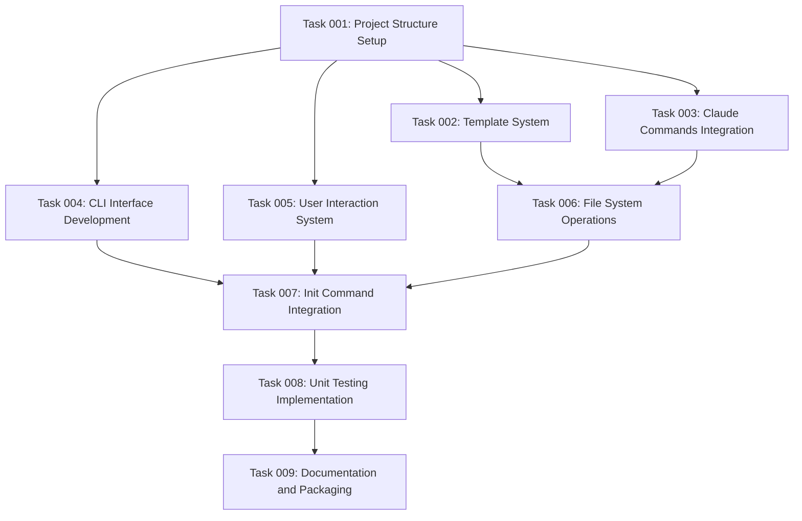

# AI Task Manager NPX Command Tool

## Executive Summary

This project creates an NPX command tool (`@e0ipso/ai-task-manager`) that enables users to initialize the AI task management system in any repository. The tool will provide a simple `npx @e0ipso/ai-task-manager init` command that sets up the necessary directory structure, copies template files, and installs Claude Code command files to enable `/task:*` functionality in any coding project.

## Context Analysis

### Objective
Create a Node.js/TypeScript NPX package that automates the setup of the AI task manager system in any repository, making it easy for developers to start using structured task planning and management with Claude Code.

### Scope
- **In Scope**: NPX command tool, file copying logic, directory structure creation, user interaction, TypeScript implementation, unit testing
- **Out of Scope**: Publishing to NPM (handled manually), advanced configuration options, integration with external task management systems

### Resources
- Node.js and TypeScript development environment
- Access to @e0ipso NPM scope
- Reference templates and command files from current workspace
- Unit testing framework (Jest recommended for Node.js projects)

### Success Criteria
- Users can run `npx @e0ipso/ai-task-manager init` in any project
- Tool successfully copies all required template files to `.ai/task-manager/`
- Tool installs Claude Code commands to appropriate locations (`.claude/commands/tasks/`)
- Interactive prompts guide users through setup process
- `--no-user-input` flag enables automated setup
- All functionality covered by unit tests
- Package is ready for NPM publication

### Dependencies
- Node.js runtime environment
- NPM package ecosystem
- File system access for target repositories
- Template files: TASK_MANAGER_INFO.md, VALIDATION_GATES.md
- Command files from `/workspace/.claude/commands/tasks/`

### Technical Requirements
- **Language**: TypeScript for type safety and maintainability
- **Runtime**: Node.js (minimum version to be determined)
- **Package Manager**: NPM for distribution
- **CLI Framework**: Commander.js or similar for argument parsing
- **File Operations**: Node.js fs module for file system operations
- **User Interaction**: Inquirer.js for interactive prompts
- **Testing**: Jest for unit testing
- **Build System**: TypeScript compiler with appropriate configuration

## Detailed Implementation Approach

### 1. Project Structure Setup
Initialize a standard Node.js/TypeScript project with:
- Package.json configuration for NPX usage
- TypeScript configuration optimized for Node.js CLI tools
- Appropriate directory structure for source, templates, and tests
- Build scripts and development tooling

### 2. Template Management System
Create a robust system to:
- Embed template files within the NPX package
- Handle file copying with proper error handling
- Maintain directory structure during copy operations
- Support template customization if needed

### 3. CLI Interface Development
Implement a command-line interface that:
- Parses command arguments and flags
- Provides clear help documentation
- Handles the `init` subcommand
- Supports `--no-user-input` flag for automation
- Provides meaningful error messages and feedback

### 4. File System Operations
Develop safe and reliable file operations to:
- Check for existing installations and handle conflicts
- Create directory structures as needed
- Copy template files to appropriate locations
- Set proper file permissions
- Validate successful installation

### 5. User Interaction System
Create an intuitive user experience with:
- Interactive prompts for configuration options
- Clear progress indicators during setup
- Confirmation of successful installation
- Guidance on next steps after installation

### 6. Testing Infrastructure
Implement comprehensive testing to:
- Test all CLI functionality with various inputs
- Mock file system operations for safe testing
- Validate template copying accuracy
- Test user interaction flows
- Ensure error conditions are handled properly

## Implementation Order

1. **Foundation Setup**: Project initialization, package.json configuration, TypeScript setup
2. **Core CLI Structure**: Basic command parsing, help system, argument validation
3. **Template System**: Template embedding, file copying logic, directory creation
4. **User Interface**: Interactive prompts, progress feedback, error messaging
5. **Integration**: Complete init command implementation with all features
6. **Testing**: Unit test development and validation
7. **Documentation**: README, usage examples, and deployment preparation

## Risk Considerations

### Potential Challenges
- **File System Permissions**: Target directories may have restricted access
- **Existing File Conflicts**: Users may have existing `.ai` or `.claude` directories
- **Template Synchronization**: Templates need to stay current with main project
- **Cross-Platform Compatibility**: Ensure functionality across Windows, macOS, and Linux
- **NPX Caching**: Users may encounter cached versions during development

### Mitigation Strategies
- Implement comprehensive error handling for file operations
- Provide clear conflict resolution options (overwrite, merge, skip)
- Create automated template updating process or clear documentation
- Test on multiple operating systems during development
- Document NPX cache clearing procedures

## Success Metrics

### Functional Metrics
- ✅ Command executes successfully on fresh repositories
- ✅ All template files copied to correct locations
- ✅ Directory structure matches expected layout
- ✅ Claude Code commands are properly installed
- ✅ Interactive prompts work as expected
- ✅ Non-interactive mode functions correctly

### Quality Metrics
- ✅ Unit test coverage above 80%
- ✅ No critical security vulnerabilities
- ✅ TypeScript compilation without errors
- ✅ Cross-platform compatibility verified
- ✅ Error handling covers edge cases

### User Experience Metrics
- ✅ Setup completes in under 30 seconds
- ✅ Clear, actionable error messages
- ✅ Intuitive command structure and help text
- ✅ Successful installation provides next steps

## Resource Requirements

### Development Tools
- Node.js (latest LTS version)
- TypeScript compiler and type definitions
- Jest testing framework
- CLI development libraries (Commander.js, Inquirer.js)
- Code formatting and linting tools (Prettier, ESLint)

### Skills Required
- TypeScript/JavaScript development
- Node.js CLI tool development
- File system operations and error handling
- NPM package development and distribution
- Unit testing with Jest
- User experience design for CLI tools

### Assets Needed
- Template files from current workspace
- Command files from `.claude/commands/tasks/`
- Package naming rights for @e0ipso scope
- Documentation and usage examples

This plan provides a comprehensive roadmap for creating a professional-grade NPX tool that will streamline the adoption of the AI task management system across different coding projects.

## Task Inventory

### Group: Foundation
- Task 001: Project structure setup with TypeScript and NPX configuration
  - Dependencies: None

### Group: Core Functionality  
- Task 002: Template system implementation for copying AI task manager files
  - Dependencies: 001
- Task 003: Claude commands integration for installing /task:* commands
  - Dependencies: 001
- Task 006: File system operations with conflict handling and validation
  - Dependencies: 002, 003

### Group: CLI Interface
- Task 004: CLI interface development with Commander.js and argument parsing
  - Dependencies: 001
- Task 005: User interaction system with Inquirer.js and progress indicators
  - Dependencies: 001

### Group: Integration
- Task 007: Init command integration orchestrating all components
  - Dependencies: 004, 005, 006

### Group: Testing
- Task 008: Unit testing implementation with Jest and mocking
  - Dependencies: 007

### Group: Documentation
- Task 009: Documentation and packaging preparation for NPM publication
  - Dependencies: 008

### Dependency Visualization

## Execution Blueprint

**Validation Gates:**
- Reference: `@.ai/task-manager/VALIDATION_GATES.md`

### Phase 1: Foundation Setup
**Parallel Tasks:**
- Task 001: Project structure setup with TypeScript and NPX configuration

### Phase 2: Core Development
**Parallel Tasks:**
- Task 002: Template system implementation for copying AI task manager files (depends on: 001)
- Task 003: Claude commands integration for installing /task:* commands (depends on: 001)
- Task 004: CLI interface development with Commander.js and argument parsing (depends on: 001)
- Task 005: User interaction system with Inquirer.js and progress indicators (depends on: 001)

### Phase 3: System Integration
**Parallel Tasks:**
- Task 006: File system operations with conflict handling and validation (depends on: 002, 003)

### Phase 4: Complete Integration
**Parallel Tasks:**
- Task 007: Init command integration orchestrating all components (depends on: 004, 005, 006)

### Phase 5: Quality Assurance
**Parallel Tasks:**
- Task 008: Unit testing implementation with Jest and mocking (depends on: 007)

### Phase 6: Final Preparation
**Parallel Tasks:**
- Task 009: Documentation and packaging preparation for NPM publication (depends on: 008)

### Post-phase Actions
Once a phase has been completed and validated, and before you move to the next phase, update the blueprint and add a ✅ emoji in front of its title. Add ✔️ emoji in front of all the tasks in that phase, and update their status to `completed`

### Execution Summary
- Total Phases: 6
- Total Tasks: 9
- Maximum Parallelism: 4 tasks (in Phase 2)
- Critical Path Length: 6 phases