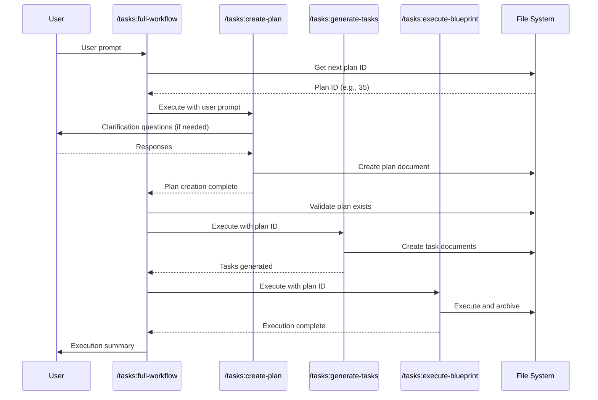
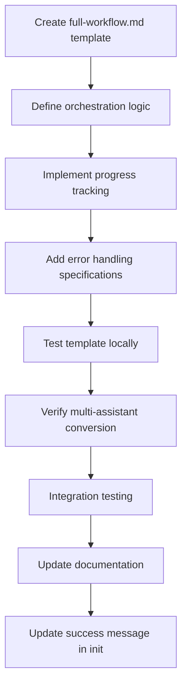
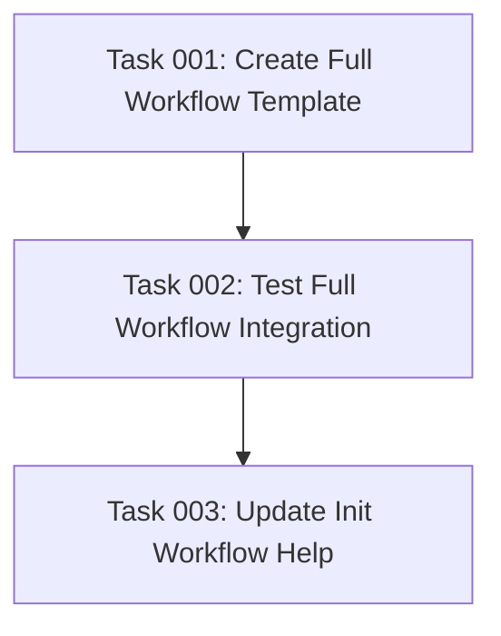

# Plan: Full Workflow Command for Automated Task Execution

## Original Work Order

> I want to create an assistant command that executes all three commands in succession. It takes a user prompt and:
>
> 1. It creates a plan with /tasks:create-plan (grabs the plan ID)
> 2. Generates the tasks with /tasks:generate-tasks
> 3. It executes the blueprint with /tasks:execute-blueprint
>
> Aside from the clarification questions it should do so without user interaction.

## Plan Clarifications

| Question | Answer |
|----------|--------|
| Q1: Command naming and location | Name: `/tasks:full-workflow`, follow existing pattern in `.claude/commands/tasks/` |
| Q2: Clarification handling | Pause execution and wait for user responses before continuing to task generation |
| Q3: Multi-assistant support | Create for all three assistants (Claude, Gemini, Open Code) |
| Q4: Error handling and recovery | Halt immediately and report the error if any step fails |
| Q5: Execution validation | Archive the plan automatically (as done by `/tasks:execute-blueprint` command) |
| Q6: Output and logging | Minimal output showing which step is running + Summary showing final results |

## Executive Summary

This plan introduces a streamlined workflow command (`/tasks:full-workflow`) that automates the end-to-end task management process by orchestrating the three existing commands in sequence. The command accepts a user prompt and executes plan creation, task generation, and blueprint execution with minimal manual intervention, while preserving critical review gates for clarification questions.

The implementation follows DRY principles by reusing existing command infrastructure rather than duplicating logic. The command acts as a lightweight orchestrator that invokes `/tasks:create-plan`, extracts the generated plan ID, passes it to `/tasks:generate-tasks`, and finally executes `/tasks:execute-blueprint`. This approach maintains consistency with existing workflows while significantly reducing friction in the development process.

The solution supports all three assistants (Claude, Gemini, Open Code) through the existing template conversion system, ensuring platform parity without additional maintenance burden.

## Context

### Current State

Users currently execute three separate commands to complete the full workflow:
1. `/tasks:create-plan [prompt]` - Creates comprehensive plan and assigns ID
2. `/tasks:generate-tasks [plan-id]` - Decomposes plan into atomic tasks
3. `/tasks:execute-blueprint [plan-id]` - Executes all tasks in dependency order

This multi-step process requires:
- Manually invoking each command sequentially
- Extracting and passing the plan ID between steps
- Context switching between commands
- Increased cognitive load for routine workflows

While this separation provides flexibility for reviewing intermediate outputs, it introduces friction for straightforward implementations where the user intends to execute the full workflow.

### Target State

A unified `/tasks:full-workflow` command that:
- Accepts a user prompt as input
- Automatically orchestrates all three commands in sequence
- Pauses for clarification questions during plan creation
- Extracts and propagates the plan ID between steps
- Halts on errors with clear diagnostic information
- Provides minimal progress indicators and comprehensive summary
- Maintains all existing validation gates and quality controls
- Works identically across all three assistant platforms

### Background

The existing three-phase progressive refinement system is theoretically sound and well-documented. However, user feedback indicates that the manual orchestration creates unnecessary friction for common workflows. Users frequently request features that execute "from prompt to implementation" while maintaining the quality benefits of staged processing.

This command addresses that need while preserving the architectural benefits of phase separation. The individual commands remain available for advanced use cases requiring intermediate review or modification.

## Technical Implementation Approach

### Command Template Creation

**Objective**: Create the source Markdown template that defines the orchestration logic for all assistants.

The template file (`templates/assistant/commands/tasks/full-workflow.md`) will contain:

1. **Frontmatter metadata** following existing command patterns:
   ```yaml
   ---
   argument-hint: [user-prompt]
   description: Execute the full workflow from plan creation to blueprint execution
   ---
   ```

2. **Assistant configuration loading** (standard across all commands):
   ```bash
   ASSISTANT=$(node .ai/task-manager/config/scripts/detect-assistant.cjs)
   node .ai/task-manager/config/scripts/read-assistant-config.cjs "$ASSISTANT"
   ```

3. **Orchestration instructions** that guide the AI to:
   - Validate user input is provided
   - Execute `/tasks:create-plan` with the user prompt via SlashCommand tool
   - Wait for clarification questions and user responses if needed
   - Extract the plan ID from the filesystem using the plan detection script
   - Execute `/tasks:generate-tasks` with the extracted plan ID
   - Execute `/tasks:execute-blueprint` with the plan ID
   - Handle errors at each step with immediate halt behavior
   - Provide minimal progress updates during execution
   - Generate comprehensive summary upon completion

4. **Todo tracking template** for progress visibility:
   ```
   - [ ] Execute /tasks:create-plan
   - [ ] Extract plan ID
   - [ ] Execute /tasks:generate-tasks
   - [ ] Execute /tasks:execute-blueprint
   - [ ] Generate execution summary
   ```

5. **Error handling specifications**:
   - Clear error messages identifying which step failed
   - Preservation of partial progress (plan remains accessible)
   - Guidance for manual recovery if needed

### Plan ID Extraction Strategy

**Objective**: Reliably detect the newly created plan ID between command invocations.

The orchestration logic will use the existing `get-next-plan-id.cjs` script to determine the expected plan ID before plan creation, then validate the plan exists after creation. This approach avoids parsing command output and leverages the robust ID management system already in place.



### Multi-Assistant Template Processing

**Objective**: Ensure consistent functionality across Claude, Gemini, and Open Code assistants.

The existing init process already handles multi-assistant support through the `createAssistantStructure()` function in `src/index.ts`:

1. **Source template**: Created as Markdown in `templates/assistant/commands/tasks/full-workflow.md`
2. **Claude**: Copied as-is to `.claude/commands/tasks/full-workflow.md`
3. **Open Code**: Copied as-is to `.opencode/command/tasks/full-workflow.md`
4. **Gemini**: Converted to TOML format via `readAndProcessTemplate()` and saved to `.gemini/commands/tasks/full-workflow.toml`

The template conversion system handles:
- Variable substitution (`$ARGUMENTS` → `{{args}}` for TOML)
- Frontmatter format transformation
- Argument reference updates (`$1` → `{{plan_id}}` where applicable)

No modifications to the conversion logic are required as the new command follows the same structural patterns as existing commands.

### Command Invocation Architecture

**Objective**: Execute existing commands without duplicating their logic.

The command template will instruct the AI assistant to use the `SlashCommand` tool (available in Claude Code) to invoke each sub-command:

```typescript
// Pseudocode representation of the orchestration logic
SlashCommand({ command: "/tasks:create-plan [user-prompt]" })
// Wait for clarification if needed
// Extract plan ID
SlashCommand({ command: "/tasks:generate-tasks [plan-id]" })
SlashCommand({ command: "/tasks:execute-blueprint [plan-id]" })
```

This approach maintains DRY principles by:
- Reusing existing command prompts and validation logic
- Preserving all hooks and quality gates from individual commands
- Avoiding code duplication or maintenance drift
- Enabling independent evolution of each command

### Progress Reporting and Summary Generation

**Objective**: Provide user visibility into workflow progress without overwhelming detail.

**Minimal Progress Updates** (during execution):
- "Step 1/4: Creating plan..."
- "Step 2/4: Extracting plan ID... (ID: 35)"
- "Step 3/4: Generating tasks..."
- "Step 4/4: Executing blueprint..."

**Comprehensive Summary** (after completion):
```
✅ Workflow completed successfully!

Plan: 35--plan-name
Location: .ai/task-manager/archive/35--plan-name/

Tasks executed: 12
Duration: [time]
Status: Archived

Review implementation at: .ai/task-manager/archive/35--plan-name/plan-35--plan-name.md
```

### Integration with Init Process

**Objective**: Ensure the new command is included when users initialize projects.

The command template placement in `templates/assistant/commands/tasks/` ensures automatic inclusion during init. The existing code in `createAssistantStructure()` already processes all files in this directory without requiring explicit enumeration.

Verification: After implementation, running `npm run build && npm start init --assistants claude,gemini,opencode --destination-directory /tmp/test` should create `full-workflow.md` (or `.toml` for Gemini) in all assistant directories.

## Risk Considerations and Mitigation Strategies

### Technical Risks

- **SlashCommand tool availability**: The orchestration depends on the SlashCommand tool being available in the AI assistant's context
  - **Mitigation**: Template instructions provide fallback guidance for manual command execution if the tool is unavailable

- **Plan ID extraction timing**: Race conditions or filesystem delays could cause ID detection failures
  - **Mitigation**: Use synchronous filesystem validation after plan creation; halt with clear error if plan not found

- **Command output parsing**: Extracting state between commands without explicit return values
  - **Mitigation**: Rely on filesystem state rather than command output parsing; use existing robust ID generation scripts

### Implementation Risks

- **Template conversion edge cases**: Complex orchestration logic may not convert cleanly to TOML for Gemini
  - **Mitigation**: Follow existing command patterns closely; test conversion during development; keep orchestration logic in natural language instructions rather than code

- **Clarification handling complexity**: Pausing for user input mid-workflow requires careful state management
  - **Mitigation**: Leverage existing `/tasks:create-plan` clarification behavior; workflow naturally pauses during sub-command execution

### User Experience Risks

- **Loss of intermediate review opportunities**: Users may skip reviewing plans/tasks when using full workflow
  - **Mitigation**: Document recommended use cases; maintain individual commands for workflows requiring intermediate review; add reminder in success summary to review archived plan

- **Error recovery confusion**: Partial execution leaves system in intermediate state
  - **Mitigation**: Clear error messages indicate which step failed; preserve all created artifacts; provide guidance for manual continuation

## Success Criteria

### Primary Success Criteria

1. **Functional completeness**: Users can invoke `/tasks:full-workflow "prompt"` and receive a fully executed, archived plan without additional intervention (aside from clarification responses)
2. **Multi-assistant parity**: Command works identically on Claude, Gemini, and Open Code platforms
3. **Error handling**: Failed steps halt execution with clear diagnostic messages indicating the failure point
4. **DRY compliance**: Zero logic duplication from existing commands; all functionality reused via invocation

### Quality Assurance Metrics

1. **Integration testing**: Successful end-to-end execution in test environment produces valid archived plan
2. **Template conversion validation**: Gemini TOML version maintains functional equivalence with Markdown version
3. **Init process verification**: Command appears in all assistant directories after running init on fresh project
4. **Documentation accuracy**: Workflow help text and command descriptions reflect new workflow option

## Resource Requirements

### Development Skills

- **Template authoring**: Markdown and TOML format familiarity
- **AI prompt engineering**: Crafting effective orchestration instructions for LLM execution
- **Shell scripting**: Understanding of existing ID generation and detection scripts
- **TypeScript/Node.js**: Comprehension of init process and template conversion system (minimal changes required)

### Technical Infrastructure

- **Existing template system**: Templates directory structure and conversion utilities
- **ID generation scripts**: `get-next-plan-id.cjs` for plan detection
- **SlashCommand tool**: Available in Claude Code for command invocation
- **Testing environment**: Ability to run init command on test directories

## Implementation Strategy



The implementation focuses on:
1. Creating a single source template in Markdown
2. Leveraging existing infrastructure for multi-assistant support
3. Reusing command invocation rather than duplicating logic
4. Testing the full workflow in all assistant environments
5. Updating user-facing documentation and help text

## Notes

**Scope boundaries**: This command implements automated orchestration only. The individual commands (`/tasks:create-plan`, `/tasks:generate-tasks`, `/tasks:execute-blueprint`) remain unchanged and available for workflows requiring intermediate review or customization.

**Future enhancements** (out of scope for this plan):
- Resume functionality for failed workflows
- Partial workflow execution (e.g., "plan + tasks only")
- Configuration options for skipping specific validation gates

**Testing considerations**: End-to-end testing should validate behavior across all three assistants, ensuring template conversion doesn't introduce functional differences.

## Task Dependencies



## Execution Blueprint

**Validation Gates:**
- Reference: `.ai/task-manager/config/hooks/POST_PHASE.md`

### ✅ Phase 1: Template Creation
**Parallel Tasks:**
- ✔️ Task 001: Create Full Workflow Template

### Phase 2: Integration Testing
**Parallel Tasks:**
- Task 002: Test Full Workflow Integration (depends on: 001)

### Phase 3: Documentation Update
**Parallel Tasks:**
- Task 003: Update Init Workflow Help (depends on: 002)

### Execution Summary
- Total Phases: 3
- Total Tasks: 3
- Maximum Parallelism: 1 task per phase (sequential execution due to dependencies)
- Critical Path Length: 3 phases
