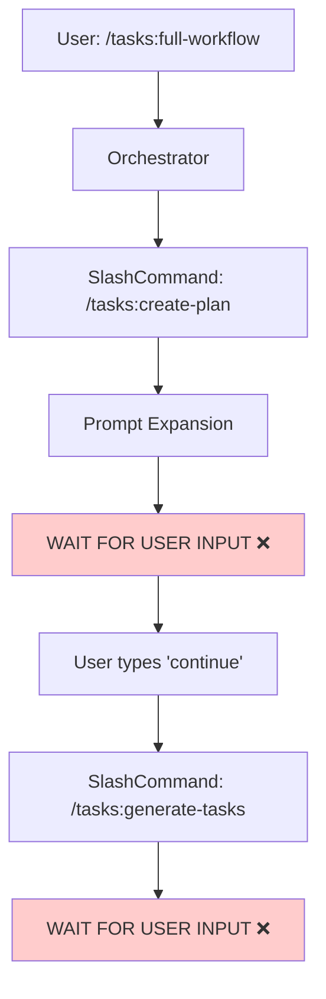
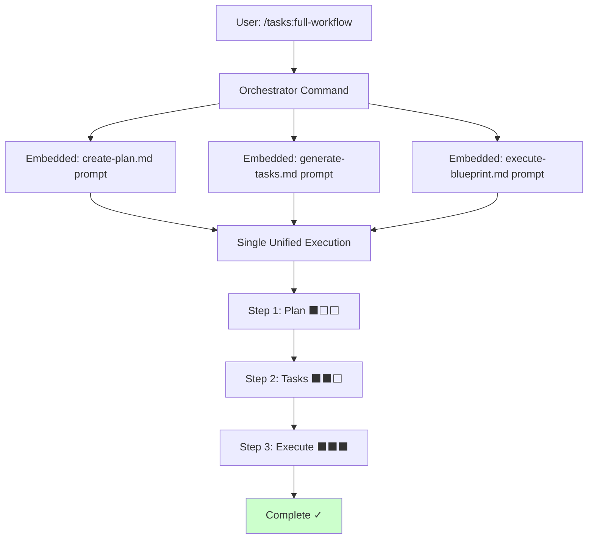

# CLAUDE.md

This file provides comprehensive guidance to Claude Code (claude.ai/code) when working with this repository. It serves as the primary context source for AI-assisted development, following Anthropic's 2025 best practices for optimal Claude integration.

## Quick Start Guide

### Essential Commands
```bash
# Build and run
npm run build && npm start init --assistants claude

# Development workflow
npm run dev           # Watch mode compilation
npm test              # Run test suite (119 tests, ~5 seconds)
npm run lint:fix      # Auto-fix code style issues

# Post-implementation validation
/tasks:fix-broken-tests "npm test"    # Fix failing tests after changes
```

### Project Initialization
```bash
# Initialize AI task management for single assistant
npx . init --assistants claude --destination-directory /path/to/project

# Initialize for multiple assistants
npx . init --assistants claude,gemini,opencode,codex --destination-directory /path/to/project

# Initialize for Codex
npx . init --assistants codex --destination-directory /path/to/project

# Re-run init to update configuration files
# Your customizations are automatically detected and protected
npx . init --assistants claude --destination-directory /path/to/project

# Force overwrite all files (bypass conflict detection)
npx . init --assistants claude --destination-directory /path/to/project --force
```

**Codex CLI Workflow**: After initialization, Codex requires an additional step. Copy the generated files from `.codex/prompts/` to `~/.codex/prompts/` in your home directory, then restart Codex to load the commands. Commands are invoked as `/prompts:tasks-create-plan`, `/prompts:tasks-generate-tasks`, etc.

### File Conflict Detection

The init command uses hash-based tracking to protect user customizations:
- Creates `.ai/task-manager/.init-metadata.json` with SHA-256 file hashes
- Compares current vs original hashes to detect user modifications
- Excludes `config/scripts/` directory from tracking
- Use `--force` flag to bypass prompts in automation

---

## Project Overview

### Purpose and Scope

This CLI tool initializes AI-assisted development environments with hierarchical task management systems. It creates structured workflows that transform complex programming requests into manageable, validated implementations through progressive refinement and atomic task decomposition.

### Core Value Proposition

- **Cognitive Load Management**: Prevents AI context overload through staged processing
- **Scope Control**: Enforces YAGNI principles and prevents feature creep
- **Quality Assurance**: Ensures working code through integrity-focused testing
- **Multi-Assistant Support**: Unified workflow across Claude, Gemini, Open Code, and Codex platforms

---

## AI Task Management System

### Three-Phase Progressive Refinement

The system implements a specialized workflow optimized for AI cognitive constraints:

#### Phase 1: Strategic Planning (`/tasks:create-plan`)
- **Focus**: Context gathering and requirement clarification
- **Output**: Comprehensive plan with mandatory clarification gates
- **Prevents**: Assumption-based planning and scope ambiguity

#### Phase 2: Task Decomposition (`/tasks:generate-tasks`)  
- **Focus**: Breaking complexity into atomic units
- **Output**: Dependency-mapped tasks with skill assignments
- **Enforces**: 20-30% task reduction and 1-2 skill maximum per task

#### Phase 3: Execution (`/tasks:execute-blueprint`)
- **Focus**: Current task implementation with minimal context
- **Output**: Working functionality with validation gates
- **Implements**: Dependency-aware parallelism and quality control

#### Plan Review Loop (`/tasks:refine-plan`)
- **Focus**: Run a feedback cycle between assistants by interrogating an existing plan
- **Output**: Updated plan document with clarified requirements, refreshed diagrams, and documented outstanding questions
- **Purpose**: Acts as the bridge between plan creation and task generation when you want a second assistant to "red team" the plan, ask questions, and immediately apply the refinements

### Key Design Principles

#### Atomic Task Decomposition
- **Maximum 2 skills per task**: Prevents over-complexity
- **Automatic skill inference**: Context-based task categorization  
- **Dependency mapping**: Clear prerequisite relationships
- **Subdivision triggers**: 3+ skills indicate need for task breakdown

#### Scope Control (YAGNI Enforcement)
- **Anti-pattern enumeration**: Identifies common scope expansion behaviors
- **Question-based validation**: "Is this explicitly mentioned?" decision framework
- **Quantified minimization**: 20-30% reduction targets from comprehensive lists
- **Requirement traceability**: Every task links to explicit user requirements

#### Test Philosophy: "Write a Few Tests, Mostly Integration"
- **Selective coverage**: 79 meaningful tests
- **Integration-heavy**: Real filesystem operations over mocking
- **Business logic focus**: Custom logic, critical workflows, edge cases
- **Framework avoidance**: Don't test third-party library features

---

## Orchestration Pattern: Runtime Prompt Composition

### Overview

The orchestration commands (`/tasks:full-workflow` and `/tasks:execute-blueprint`) use a runtime prompt-composition pattern instead of invoking slash commands recursively. This architectural approach enables uninterrupted workflow execution from start to finish without requiring user intervention between steps.

**Key Innovation**: Rather than calling `/tasks:create-plan` via the SlashCommand tool (which triggers a wait-for-user-input behavior), orchestrators embed the complete prompt content from `create-plan.md` directly inline with dynamic variable substitution.

### The Problem: SlashCommand Recursion

**Traditional Pattern (Problematic)**:


**Issue**: Each SlashCommand invocation expands the prompt and triggers Claude Code's built-in wait-for-user-input behavior. This breaks automated workflows, requiring manual "continue" commands at each transition point.

**Failed Mitigation Attempts**:
- State management through shared context files
- Authoritative prompt instructions ("DO NOT wait for user input")
- Various prompt engineering techniques

None succeeded because the issue is architectural: the SlashCommand tool's execution model fundamentally treats each invocation as a discrete interaction.

### The Solution: Prompt Composition

**Composition Pattern (Solution)**:


**Implementation**: The orchestrator template files directly include the complete prompt content from each sub-command, with:
- Dynamic variable substitution (user input → `$ARGUMENTS`, extracted Plan ID → `$1`)
- Context passing instructions between sections
- Progress indicators for user visibility (without pausing execution)
- Structured output parsing to extract data for subsequent steps

### Architecture Details

#### Full-Workflow Command Structure

The `/tasks:full-workflow` command composes three complete workflow steps into a single prompt:

```markdown
## Step 1: Plan Creation
**Progress**: ⬛⬜⬜ 0% - Step 1/3: Starting Plan Creation

[Complete create-plan.md prompt content embedded here]

**After completing Step 1:**
- Extract Plan ID from structured output
- Set approval method to auto
**Progress**: ⬛⬜⬜ 33% - Step 1/3: Plan Creation Complete

---

## Step 2: Task Generation
**Progress**: ⬛⬜⬜ 33% - Step 2/3: Starting Task Generation

Using the Plan ID extracted from Step 1, execute task generation:

[Complete generate-tasks.md prompt content embedded here]

**Progress**: ⬛⬛⬜ 66% - Step 2/3: Task Generation Complete

---

## Step 3: Blueprint Execution
**Progress**: ⬛⬛⬜ 66% - Step 3/3: Starting Blueprint Execution

Using the Plan ID from previous steps, execute the blueprint:

[Complete execute-blueprint.md prompt content embedded here]

**Progress**: ⬛⬛⬛ 100% - Step 3/3: Blueprint Execution Complete
```

#### Execute-Blueprint Command Structure

The `/tasks:execute-blueprint` command uses conditional composition for auto-generating missing tasks:

```markdown
## Task and Blueprint Validation

Before proceeding with execution, validate that tasks exist:

```bash
task_count=$(node .ai/task-manager/config/scripts/validate-plan-blueprint.cjs $1 taskCount)
blueprint_exists=$(node .ai/task-manager/config/scripts/validate-plan-blueprint.cjs $1 blueprintExists)
```

If either `$task_count` is 0 or `$blueprint_exists` is "no":
   - Display notification: "⚠️ Tasks or execution blueprint not found. Generating tasks automatically..."
   - Set approval_method_tasks to auto
   - Execute the following task generation process inline:

   ## Embedded Task Generation

   [Complete generate-tasks.md prompt content embedded here]

   ## Resume Blueprint Execution

   After task generation completes, continue with execution...

Otherwise, if tasks exist, proceed directly to execution.
```

### Context Passing Between Steps

Information flows through the workflow via structured output parsing:

1. **User Input → Step 1**: User prompt becomes `$ARGUMENTS` in create-plan section
2. **Step 1 → Step 2**: Create-plan outputs structured format:
   ```
   ---
   Plan Summary:
   - Plan ID: 51
   - Plan File: /path/to/plan-51--name.md
   ```
   Orchestrator extracts `51` and uses as `$1` in generate-tasks section
3. **Step 2 → Step 3**: Generate-tasks outputs task count for progress tracking
4. **Continuous Flow**: All steps execute sequentially without pausing

### When to Use Each Pattern

#### Use Standalone Commands When:

- **Running single workflow steps independently**: Execute just plan creation or just task generation
- **User review is needed between steps**: Manual approval workflow where the user wants to review the plan before generating tasks
- **Debugging or testing individual components**: Isolate a specific command for troubleshooting
- **Iterative refinement**: Make adjustments to a plan or tasks before proceeding to execution
- **Cross-assistant plan reviews are required**: Have a second assistant interrogate an existing plan with `/tasks:refine-plan [planId]` before kicking off task generation

**Examples**:
```bash
# Create plan for manual review before proceeding
/tasks:create-plan "Implement user authentication system"

# Run a plan refinement session before generating tasks
/tasks:refine-plan 51

# Generate tasks after reviewing and adjusting the plan
/tasks:generate-tasks 51

# Execute a pre-approved and reviewed blueprint
/tasks:execute-blueprint 51
```

#### Use Orchestration Commands When:

- **Executing the complete workflow without interruption**: Full automation from idea to implementation
- **Plan is already conceptually approved**: User has confidence in the approach and wants immediate execution
- **Rapid prototyping or experimentation**: Quick iterations where the implementation can be reviewed after completion
- **Batch processing multiple features**: Running several full workflows sequentially in automated pipelines

**Examples**:
```bash
# Full automated workflow from concept to completion
/tasks:full-workflow "Add dark mode toggle to application settings"

# Execute a plan that might need task generation first
/tasks:execute-blueprint 51  # Auto-generates tasks if missing
```

### Progress Indicators

**Scope**: Progress indicators are used **only in the full-workflow command** to show progress across its three major steps. The execute-blueprint command has its own phase-based progress tracking and does not need additional indicators.

**Format**:
```
⬛⬜⬜ 33% - Step 1/3: Plan Creation Complete
⬛⬛⬜ 66% - Step 2/3: Task Generation Complete
⬛⬛⬛ 100% - Step 3/3: Blueprint Execution Complete
```

**Purpose**: Provide clear visual feedback about workflow status without interrupting execution. These are informational only and do not pause the workflow.

### Backward Compatibility

The composition pattern maintains full backward compatibility:

- **Individual commands remain unchanged**: `/tasks:create-plan`, `/tasks:refine-plan`, `/tasks:generate-tasks`, and `/tasks:execute-blueprint` continue to function as standalone slash commands
- **Existing workflows unaffected**: Projects using manual step-by-step workflows see no changes in behavior
- **Template system intact**: All template processing, variable substitution, and format conversion (Markdown/TOML) work identically
- **Approval methods preserved**: Both `approval_method_plan` and `approval_method_tasks` function correctly in all contexts

---

## Architecture Overview

### Core Components

#### CLI Entry Point (`src/cli.ts`)
```typescript
// Key responsibilities:
- Commander.js argument parsing
- Single `init` command with required `--assistants` flag  
- Error routing and exit code management
- Colored logging initialization
```

#### Main Implementation (`src/index.ts`)
```typescript
// Core business logic:
- init() function for project initialization
- Directory structure creation (.ai/task-manager/, .claude/, etc.)
- Template processing workflow (Markdown → format conversion)
- Assistant-specific setup and template copying
```

#### Utilities (`src/utils.ts`)
```typescript
// Supporting operations:
- File system: ensureDir(), copyTemplate(), exists()
- Validation: parseAssistants(), validateAssistants()  
- Template processing: convertMdToToml(), readAndProcessTemplate()
- Path handling: resolvePath() with cross-platform support
```

#### Type System (`src/types.ts`)
```typescript
// Type definitions:
- Assistant type: 'claude' | 'gemini' | 'opencode' | 'codex'
- TemplateFormat: 'md' | 'toml'
- Custom error classes: FileSystemError, ConfigError
- Interface definitions for configurations and results
```

### Template System Architecture

#### Single Source of Truth Approach
- **Markdown authoring**: All templates written in Markdown format
- **Dynamic conversion**: TOML generation for Gemini assistant
- **Variable transformation**: Format-specific syntax conversion
- **Consistency validation**: Functionality parity across formats

#### Template Processing Flow
1. **Source**: Read Markdown template from `templates/commands/tasks/`
2. **Parse**: Extract YAML frontmatter and body content
3. **Convert**: Transform to TOML for Gemini (Markdown for others)
4. **Substitute**: Apply variable transformations (`$ARGUMENTS` → `{{args}}`)
5. **Output**: Write to assistant-specific directories

#### Variable Transformation Mapping
```
Markdown → TOML
$ARGUMENTS → {{args}}
$1 → {{plan_id}}
[planId] → {{plan_id}} (frontmatter)
[userPrompt] → {{args}} (frontmatter)
```

---

## Directory Structure and Organization

### Generated Project Structure
```
project/
├── .ai/task-manager/              # Shared project configuration
│   ├── plans/                     # Active plans with task subdirectories
│   │   └── 28--current-plan/
│   │       ├── plan-28--current-plan.md
│   │       └── tasks/
│   │           ├── 01--task-one.md
│   │           └── 02--task-two.md
│   ├── archive/                   # Completed plans (preserved history)
│   │   └── 25--archived-plan/     # Full structure maintained
│   ├── config/
│   │   ├── TASK_MANAGER.md        # Project context (user-editable)
│   │   ├── scripts/               # Enhanced ID generation
│   │   │   ├── get-next-plan-id.cjs
│   │   │   └── get-next-task-id.cjs
│   │   └── hooks/
│   │       └── POST_PHASE.md      # Quality criteria (user-editable)
│   └── templates/                 # Project-specific templates
│       ├── PLAN_TEMPLATE.md       # Customizable plan template
│       └── TASK_TEMPLATE.md       # Customizable task template
├── .claude/commands/tasks/        # Claude commands (Markdown)
│   ├── create-plan.md
│   ├── refine-plan.md             # NEW: Plan feedback/refinement loop
│   ├── generate-tasks.md
│   ├── execute-blueprint.md
│   └── fix-broken-tests.md        # NEW: Test integrity command
├── .gemini/commands/tasks/        # Gemini commands (TOML)
│   ├── create-plan.toml
│   ├── refine-plan.toml           # NEW: Plan feedback/refinement loop
│   ├── generate-tasks.toml
│   ├── execute-blueprint.toml
│   └── fix-broken-tests.toml      # NEW: Test integrity command
├── .opencode/command/tasks/       # Open Code commands (Markdown)
│   ├── create-plan.md
│   ├── refine-plan.md             # NEW: Plan feedback/refinement loop
│   ├── generate-tasks.md
│   ├── execute-blueprint.md
│   └── fix-broken-tests.md        # NEW: Test integrity command
├── .codex/prompts/                # Codex commands (Markdown, flat structure)
│   ├── tasks-create-plan.md
│   ├── tasks-refine-plan.md       # NEW: Plan feedback/refinement loop
│   ├── tasks-generate-tasks.md
│   ├── tasks-execute-blueprint.md
│   ├── tasks-execute-task.md
│   ├── tasks-fix-broken-tests.md  # NEW: Test integrity command
│   └── tasks-full-workflow.md
└── .github/prompts/               # GitHub Copilot prompts (Markdown, flat structure)
    ├── tasks-create-plan.prompt.md
    ├── tasks-refine-plan.prompt.md
    ├── tasks-generate-tasks.prompt.md
    ├── tasks-execute-task.prompt.md
    ├── tasks-execute-blueprint.prompt.md
    ├── tasks-fix-broken-tests.prompt.md
    └── tasks-full-workflow.prompt.md
```

### Assistant-Specific Differences

#### Codex CLI Workflow

Codex has unique requirements due to its architecture:

**Directory Structure**:
- Uses flat file structure in `.codex/prompts/` (no nested `tasks/` subdirectory)
- File naming pattern: `tasks-{command-name}.md` (e.g., `tasks-create-plan.md`)
- All files stored in single directory for Codex's command discovery

**User Workflow**:
1. Run initialization: `npx . init --assistants codex --destination-directory /path/to/project`
2. Copy generated files to home directory: `cp -r .codex/prompts/* ~/.codex/prompts/`
3. Restart Codex CLI to load the new commands
4. Invoke commands using `/prompts:` prefix: `/prompts:tasks-create-plan`, `/prompts:tasks-generate-tasks`, etc.

**Key Differences**:
- **Manual file copy required**: Unlike other assistants, Codex reads commands from `~/.codex/prompts/` in the user's home directory
- **Session restart needed**: Changes to prompts require restarting Codex
- **Flat structure**: No hierarchical organization; all files in one directory
- **Naming convention**: Hyphenated prefixes (`tasks-`) instead of directory nesting

**Command Invocation Examples**:
```bash
# Create a new plan
/prompts:tasks-create-plan "Implement user authentication system"

# Refine an existing plan
/prompts:tasks-refine-plan 51

# Generate tasks from a plan
/prompts:tasks-generate-tasks 51

# Execute the blueprint
/prompts:tasks-execute-blueprint 51

# Full automated workflow
/prompts:tasks-full-workflow "Add dark mode toggle to application settings"

# Fix broken tests
/prompts:tasks-fix-broken-tests "npm test"
```

**Important Codex Compatibility Note**:
- **Use lowercase bash variables**: Codex has issues with uppercase bash variable names (e.g., `TASK_COUNT`)
- **Prefer lowercase convention**: Use `task_count`, `plan_id`, etc. instead of uppercase equivalents
- This applies to all bash scripts and command templates to ensure cross-assistant compatibility

#### GitHub Copilot Workflow

GitHub Copilot uses prompt files for IDE integration:

**Directory Structure**:
- Uses `.github/prompts/` directory for prompt file storage
- File naming pattern: `tasks-{command-name}.prompt.md` (e.g., `tasks-create-plan.prompt.md`)
- Prompt files use minimal YAML frontmatter with `description` field
- Native `$ARGUMENTS` placeholder support (no variable transformation needed)

**User Workflow**:
1. Run initialization: `npx . init --assistants github --destination-directory /path/to/project`
2. Prompt files are automatically discovered by GitHub Copilot in VS Code and JetBrains IDEs
3. Invoke commands using `/tasks-{command}` syntax in GitHub Copilot chat

**IDE Requirements**:
- **Supported**: VS Code with GitHub Copilot extension, JetBrains IDEs with GitHub Copilot plugin
- **Not Supported**: GitHub Copilot CLI (command line interface)
- Requires active GitHub Copilot subscription

**Command Invocation Examples**:
```bash
# Create a new plan
/tasks-create-plan Implement user authentication system

# Refine an existing plan
/tasks-refine-plan 51

# Generate tasks from a plan
/tasks-generate-tasks 51

# Execute a single task
/tasks-execute-task 51 3

# Execute the complete blueprint
/tasks-execute-blueprint 51

# Full automated workflow
/tasks-full-workflow Add dark mode toggle to application settings

# Fix broken tests
/tasks-fix-broken-tests npm test
```

**Key Features**:
- **Minimal Frontmatter**: Simple YAML metadata with `description` field only
- **Native Placeholder Support**: `$ARGUMENTS` works natively in GitHub Copilot (no conversion needed)
- **IDE Integration**: Commands appear automatically in Copilot chat interface
- **No Manual Setup**: Unlike Codex, no file copying or session restart required

**Limitations**:
- Prompt files are in public preview and subject to change
- Only works in IDE environments (VS Code, JetBrains), not in terminal/CLI
- Seven commands supported: create-plan, refine-plan, generate-tasks, execute-task, execute-blueprint, fix-broken-tests, full-workflow

### Archive System and Lifecycle Management

#### Purpose and Benefits
- **Organization**: Clean active workspace with historical preservation
- **Reference**: Past implementations available for pattern reuse
- **ID Management**: Prevents conflicts through continuous numbering
- **Compliance**: Maintains audit trail of project evolution

#### Archival Process
```bash
# Manual archival after completion
mv .ai/task-manager/plans/25--completed-plan .ai/task-manager/archive/

# Validation of archive integrity
DEBUG=true node .ai/task-manager/config/scripts/get-next-plan-id.cjs
```

---

## Enhanced Features and Commands

### Refine-Plan Command

#### Why It Exists

The `/tasks:refine-plan [planId]` command enables a feedback loop between multiple LLMs (or between an LLM and a human). One assistant creates the initial plan, then the refine-plan command lets another assistant:
- Load the plan context safely via `detect-assistant.cjs` and `read-assistant-config.cjs`
- Inspect the document section-by-section, highlighting gaps, contradictions, or gold-plated scope
- Ask targeted clarifying questions and log the answers back into the "Plan Clarifications" table
- Apply edits directly in the plan file while preserving the original plan ID and template structure
- Append a change log so downstream assistants understand what changed during refinement

#### Usage Workflow

```bash
# Have another assistant interrogate Plan 41
/tasks:refine-plan 41
```

During the session the assistant should:
1. Run `.ai/task-manager/config/hooks/PRE_PLAN.md`
2. Provide a baseline summary plus a gap analysis (context, technical, risk, scope)
3. Loop on clarification questions until blockers are resolved or explicitly noted
4. Update the plan file using `.ai/task-manager/config/templates/PLAN_TEMPLATE.md` as the guardrail
5. Re-run `.ai/task-manager/config/hooks/POST_PLAN.md`
6. Output the structured **Plan Refinement Summary** so orchestrators can continue with `/tasks:generate-tasks`

This command is ideal when you want a "red team" review before task generation, ensuring scope discipline and better downstream execution.

### Fix-Broken-Tests Command

#### Critical Integrity Requirements

The fix-broken-tests command enforces strict integrity standards to prevent "test cheating":

**❌ Absolutely Forbidden Practices**:
- Adding environment checks to bypass test execution
- Modifying test assertions to match broken implementation  
- Implementing test-environment-specific code in source
- Disabling or commenting out failing tests
- ANY workaround that doesn't fix the actual bug

**✅ Required Approach**:
- Find root cause in source code
- Fix the actual bug in implementation
- Ensure tests pass because code truly works

#### Usage Examples
```bash
# Fix tests after feature implementation
/tasks:fix-broken-tests "npm test"

# Fix specific test file
/tasks:fix-broken-tests "jest src/__tests__/user-auth.test.ts"

# Auto-detect test command from CLAUDE.md
/tasks:fix-broken-tests ""

# Integration with development workflow
git commit -m "feat: implement feature"
/tasks:fix-broken-tests "npm test"
git commit -m "fix: resolve test failures from implementation"
```

### Enhanced ID Generation Scripts

#### get-next-plan-id.cjs
**Features**:
- Comprehensive directory traversal from any subdirectory
- Multi-source ID validation (directories, filenames, frontmatter)
- Enhanced error handling with graceful degradation
- Debug logging via `DEBUG=true` environment variable
- Consistency validation with mismatch reporting

```bash
# Generate next plan ID with debug info
DEBUG=true node .ai/task-manager/config/scripts/get-next-plan-id.cjs
```

#### get-next-task-id.cjs  
**Features**:
- Performance optimization for empty directories (90% case)
- Flexible ID format support (padded and unpadded)
- Resilient YAML parsing with multiple regex patterns
- Graceful error handling for corrupted files

```bash
# Generate next task ID for specific plan
node .ai/task-manager/config/scripts/get-next-task-id.cjs 28
```

---

## Development Workflow

### Standard Development Commands

#### Build and Development
```bash
npm run build        # TypeScript compilation to dist/
npm run dev          # Watch mode with automatic recompilation  
npm run clean        # Remove dist/ directory
npm start            # Execute compiled CLI (requires build first)
```

#### Testing and Quality Assurance
```bash
npm test             # Run Jest test suite (119 tests, ~5 seconds)
npm run test:watch   # Tests in watch mode for development
npm run lint         # ESLint validation (excludes test files)
npm run lint:fix     # Automated lint fixes
npm run format       # Prettier code formatting
```

#### Security and Maintenance
```bash
npm run security:audit        # Standard security audit
npm run security:audit-json   # JSON formatted audit output  
npm run security:fix          # Automated security fixes
npm run security:fix-force    # Force fixes for critical issues
npm run prepublishOnly        # Pre-publish validation (auto-runs)
```

### Testing Philosophy Implementation

#### Current Test Statistics
- **Test Suites**: 7 passed, 7 total
- **Tests**: 119 passed, 119 total
- **Execution Time**: ~5 seconds
- **Coverage**: 24% lines (deliberately selective)

#### Test File Organization
- `src/__tests__/utils.test.ts`: Business logic validation
- `src/__tests__/cli.integration.test.ts`: End-to-end workflows
- `src/__tests__/get-next-plan-id.test.ts`: ID generation validation

#### Testing Guidelines
**DO Test**:
- Data transformation and validation logic
- Complex business rules and algorithms
- Error scenarios and edge cases
- Integration points and workflows
- Critical path functionality

**DON'T Test**:
- Simple getters/setters
- Third-party library features
- Framework-provided functionality
- Obvious utility functions
- Trivial CRUD operations

### Adding New Assistant Support

To add a new AI assistant (like Codex was added to the existing Claude, Gemini, and Open Code support), follow these steps:

1. **Type System**: Update `Assistant` type in `src/types.ts`
   ```typescript
   // Add new assistant to the union type
   export type Assistant = 'claude' | 'gemini' | 'opencode' | 'codex' | 'newassistant';
   ```

2. **Format Mapping**: Add template format in `getTemplateFormat()` (`src/utils.ts`)
   ```typescript
   export function getTemplateFormat(assistant: Assistant): TemplateFormat {
     if (assistant === 'gemini') return 'toml';
     return 'md';  // Default for Claude, Open Code, Codex, and new assistants
   }
   ```

3. **Directory Structure Mapping**: Add directory configuration in `getAssistantConfig()` (`src/utils.ts`)
   ```typescript
   export function getAssistantConfig(assistant: Assistant) {
     const configs = {
       claude: { dir: '.claude/commands', subdir: 'tasks' },
       gemini: { dir: '.gemini/commands', subdir: 'tasks' },
       opencode: { dir: '.opencode/command', subdir: 'tasks' },
       codex: { dir: '.codex/prompts', subdir: null },  // Flat structure example
       newassistant: { dir: '.newassistant/commands', subdir: 'tasks' }
     };
     return configs[assistant];
   }
   ```

4. **File Naming Convention**: Update `getCommandFileName()` if needed (`src/utils.ts`)
   ```typescript
   export function getCommandFileName(assistant: Assistant, command: string): string {
     // Codex uses hyphenated naming (tasks-create-plan.md)
     if (assistant === 'codex') {
       return `tasks-${command}.${getTemplateFormat(assistant)}`;
     }
     // Others use plain names (create-plan.md, create-plan.toml)
     return `${command}.${getTemplateFormat(assistant)}`;
   }
   ```

5. **Template Directories**: Create template files in `templates/commands/tasks/` (if needed for custom formats)

6. **Testing**: Add integration tests for new assistant in `src/__tests__/`
   - Test directory creation
   - Test template processing and format conversion
   - Test end-to-end initialization workflow
   - Verify file naming conventions
   - Validate variable substitution

7. **Documentation**: Update `AGENTS.md` with:
   - Assistant name in "Core Value Proposition"
   - Initialization examples
   - Directory structure diagram
   - Any assistant-specific workflow requirements
   - Command invocation examples

**Example: Codex Implementation**

The Codex assistant was added with these characteristics:
- **Flat directory structure**: `.codex/prompts/` with no subdirectories
- **Hyphenated file naming**: `tasks-create-plan.md` instead of nested `tasks/create-plan.md`
- **Markdown format**: Uses `.md` files like Claude and Open Code
- **Special workflow**: Requires copying files to `~/.codex/prompts/` and restarting Codex
- **Command prefix**: `/prompts:tasks-*` instead of `/tasks:*`

These unique requirements were handled through conditional logic in `getAssistantConfig()` and `getCommandFileName()` without needing changes to the core template system.

### Template Development Workflow

1. **Source Creation**: Author Markdown templates in `templates/commands/tasks/`
2. **Metadata**: Use standard YAML frontmatter format
3. **Variable Testing**: Verify substitution across all formats
4. **Output Validation**: Check Claude (.md), Gemini (.toml), Open Code (.md), Codex (.md)
5. **Integration Testing**: Validate end-to-end template processing

**Important Bash Variable Naming Convention**:
- **Always use lowercase** for bash variables in templates (e.g., `task_count`, `plan_id`, `blueprint_exists`)
- **Never use uppercase** bash variable names (e.g., `TASK_COUNT`, `PLAN_ID`) - this causes compatibility issues with Codex
- Template placeholders like `$ARGUMENTS` and `$1` are exceptions as they're not bash variables
- This convention ensures cross-assistant compatibility and prevents execution issues

---

## Template Customization Guide

### Plan Template Structure

**YAML Frontmatter**:
```yaml
id: [planId]
summary: "[userPrompt]"
created: "YYYY-MM-DD"
```

**Core Sections**:
- Original Work Order
- Plan Clarifications  
- Executive Summary
- Context and Background
- Technical Implementation Approach
- Risk Considerations
- Success Criteria
- Resource Requirements

### Task Template Structure

**YAML Frontmatter**:
```yaml
id: [task-number]
group: "[logical-grouping]"
dependencies: [list-of-task-ids]
status: "pending"
created: "YYYY-MM-DD"
skills: ["skill-1", "skill-2"]
```

**Core Sections**:
- Objective
- Skills Required
- Acceptance Criteria
- Technical Requirements
- Input Dependencies
- Output Artifacts
- Implementation Notes

### Customization Guidelines

#### Source Templates Location
```bash
# Edit base templates
/workspace/templates/ai-task-manager/config/templates/PLAN_TEMPLATE.md
/workspace/templates/ai-task-manager/config/templates/TASK_TEMPLATE.md
```

#### Customization Best Practices
- **Maintain Structure**: Keep YAML frontmatter format
- **Preserve Core Sections**: Don't remove critical metadata fields
- **Add Context**: Include project-specific guidance
- **Stay Focused**: Keep templates concise and actionable

#### Template Processing Validation
```bash
# Test template processing for all formats
npm run build
node dist/cli.js init --assistants claude,gemini,opencode,codex --destination-directory /tmp/test
```

---

## Error Handling and Troubleshooting

### Common Issues and Solutions

#### ID Generation Problems
**Symptoms**: ID conflicts, missing plans, inconsistent numbering
**Debugging**:
```bash
# Enable comprehensive debug logging
DEBUG=true node .ai/task-manager/config/scripts/get-next-plan-id.cjs
```
**Solutions**: Verify directory structure, check file permissions, align ID sources

#### Template Processing Errors
**Symptoms**: Malformed TOML, missing variables, conversion failures
**Debugging**: Check template syntax, validate frontmatter format, verify variable names
**Solutions**: Use standard frontmatter, test variable substitution, validate against schema

#### Assistant Integration Issues
**Symptoms**: Commands not found, format errors, execution failures
**Debugging**: Verify assistant directory creation, check template format conversion
**Solutions**: Rebuild templates, validate format mapping, check file permissions

### Error Handling Architecture

#### Custom Error Classes
```typescript
// From src/types.ts
FileSystemError    // File operation failures
ConfigError        // Configuration validation issues  
TemplateError      // Template processing problems
AssistantError     // Assistant validation failures
```

#### Error Recovery Strategies
- **Graceful Degradation**: Continue operation when possible
- **Detailed Logging**: Provide context for debugging
- **User-Friendly Messages**: Clear guidance for resolution
- **Fail-Fast**: Stop early for critical errors

---

## Quality Assurance and Best Practices

### Code Quality Standards

#### Formatting Requirements
- **No trailing spaces**: Enforced by Prettier
- **File endings**: Always include newline at end
- **Indentation**: Match existing code patterns
- **Naming**: Use meaningful variable and function names

#### Architecture Principles
- **Modularity**: Write reusable, focused components
- **Single Responsibility**: Keep functions small and focused
- **Standard Patterns**: Prefer established patterns over novel approaches
- **Minimal Dependencies**: Add external dependencies only when essential

### Security Guidelines

#### Critical Security Practices
- **No hardcoded secrets**: Use environment variables
- **Input validation**: Sanitize all user inputs
- **Error handling**: Don't expose internal system details
- **Least privilege**: Minimize permission requirements
- **Audit integration**: Regular security scanning

### Performance Considerations

#### Optimization Strategies
- **Fast test execution**: 3-second test suite for quick feedback
- **Efficient ID generation**: Early returns for common cases
- **Template caching**: Minimize redundant file operations
- **Memory management**: Clean up temporary resources

---

## Theoretical Foundations and Research Context

### Cognitive Load Theory Application

The system applies established Cognitive Load Theory principles:
- **Intrinsic Load Minimization**: Atomic task decomposition
- **Extraneous Load Reduction**: Context isolation and progressive disclosure  
- **Germane Load Optimization**: Structured templates and decision frameworks

Research demonstrates 25% improvement in task completion accuracy through proper cognitive load management in AI systems.

### Multi-Agent System Coordination

Implementation of proven coordination patterns:
- **Task Allocation**: Skill-based matching and domain expertise
- **Communication Protocol**: Structured artifacts vs. direct parameter passing
- **Conflict Resolution**: Validation gates and dependency management
- **Collaborative Enhancement**: Specialized agents outperforming generalist approaches

### Mixture of Agents (MoA) Framework

Leverages "collaborativeness" phenomenon where LLMs generate better responses when presented with outputs from other models. The three-phase approach builds progressive refinement through layered artifact creation.

### Research Validation

- **Sequential Processing**: 55% accuracy vs. lower one-step performance
- **Specialized Agents**: 30.4% task completion for clear goals vs. 0% for broad context
- **Context Window Optimization**: Phase-based processing prevents information overload
- **Quality Assurance**: Multi-layer validation ensures reliable execution

---

## Integration with Claude Code Workflow

### Context Utilization Optimization

This CLAUDE.md is structured to provide Claude Code with:
- **Immediate Access**: Essential commands and quick start information
- **Progressive Detail**: Hierarchical information disclosure
- **Cross-References**: Clear navigation between related sections
- **Workflow Integration**: Seamless connection to task management system

### Claude Code Specific Features

#### Enhanced Context Understanding
- **Purpose-Driven Sections**: Each section serves specific development workflow needs
- **Cross-Reference Navigation**: Links between related concepts and procedures
- **Implementation Guidance**: Step-by-step instructions for complex operations
- **Error Recovery**: Comprehensive troubleshooting and debugging guidance

#### AI-Optimized Information Architecture
- **Logical Grouping**: Related information clustered for efficient processing
- **Consistent Structure**: Predictable section organization for reliable navigation
- **Clear Hierarchies**: Well-defined information levels for appropriate detail selection
- **Actionable Content**: Focus on implementable guidance over theoretical explanation

### Workflow Integration Points

1. **Project Initialization**: Seamless setup of AI task management
2. **Development Process**: Integrated commands for build, test, and validation
3. **Quality Assurance**: Built-in testing and integrity validation
4. **Collaboration**: Multi-assistant support with consistent workflows
5. **Documentation**: Self-maintaining documentation through structured templates

This comprehensive guide ensures agents have optimal context for effective collaboration on this AI task management CLI project.
