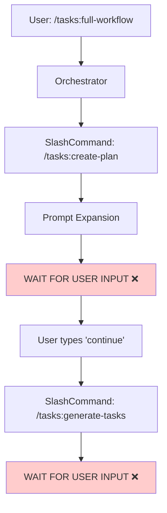

# AGENTS.md

This file provides comprehensive guidance to AI assistants when working with this repository. It serves as the primary context source for AI-assisted development across multiple platforms (Claude, Codex, Cursor, Gemini, GitHub Copilot, Open Code).

## Quick Start Guide

### Essential Commands
```bash
# Build and run
npm run build && npm start init --assistants claude

# Development workflow
npm run dev           # Watch mode compilation
npm test              # Run test suite
npm run lint:fix      # Auto-fix code style issues

# Post-implementation validation
/tasks:fix-broken-tests "npm test"    # Fix failing tests after changes
```

### Project Initialization
```bash
# Single assistant
npx . init --assistants claude --destination-directory /path/to/project

# Multiple assistants
npx . init --assistants claude,gemini,cursor,codex --destination-directory /path/to/project

# Update existing (customizations auto-protected)
npx . init --assistants claude --destination-directory /path/to/project

# Force overwrite all
npx . init --assistants claude --destination-directory /path/to/project --force
```

**Codex CLI Workflow**: After initialization, Codex requires an additional step. Copy the generated files from `.codex/prompts/` to `~/.codex/prompts/` in your home directory, then restart Codex to load the commands. Commands are invoked as `/prompts:tasks-create-plan`, `/prompts:tasks-generate-tasks`, etc.

### File Conflict Detection

The init command uses hash-based tracking to protect user customizations:
- Creates `.ai/task-manager/.init-metadata.json` with SHA-256 file hashes
- Compares current vs original hashes to detect user modifications
- Excludes `config/scripts/` directory from tracking
- Use `--force` flag to bypass prompts in automation

---

## Project Overview

### Purpose and Scope

This CLI tool initializes AI-assisted development environments with hierarchical task management systems. It creates structured workflows that transform complex programming requests into manageable, validated implementations through progressive refinement and atomic task decomposition.

### Core Value Proposition

- **Cognitive Load Management**: Prevents AI context overload through staged processing
- **Scope Control**: Enforces YAGNI principles and prevents feature creep
- **Quality Assurance**: Ensures working code through integrity-focused testing
- **Multi-Assistant Support**: Unified workflow across Claude, Codex, Cursor, Gemini, GitHub, and Open Code platforms

---

## AI Task Management System

### Three-Phase Progressive Refinement

The system implements a specialized workflow optimized for AI cognitive constraints:

#### Phase 1: Strategic Planning (`/tasks:create-plan`)
- **Focus**: Context gathering and requirement clarification
- **Output**: Comprehensive plan with mandatory clarification gates
- **Prevents**: Assumption-based planning and scope ambiguity

#### Phase 2: Task Decomposition (`/tasks:generate-tasks`)  
- **Focus**: Breaking complexity into atomic units
- **Output**: Dependency-mapped tasks with skill assignments
- **Enforces**: 20-30% task reduction and 1-2 skill maximum per task

#### Phase 3: Execution (`/tasks:execute-blueprint`)
- **Focus**: Current task implementation with minimal context
- **Output**: Working functionality with validation gates
- **Implements**: Dependency-aware parallelism and quality control

#### Plan Review Loop (`/tasks:refine-plan`)
- **Focus**: Run a feedback cycle between assistants by interrogating an existing plan
- **Output**: Updated plan document with clarified requirements, refreshed diagrams, and documented outstanding questions
- **Purpose**: Acts as the bridge between plan creation and task generation when you want a second assistant to "red team" the plan, ask questions, and immediately apply the refinements

### Key Design Principles

#### Atomic Task Decomposition
- **Maximum 2 skills per task**: Prevents over-complexity
- **Automatic skill inference**: Context-based task categorization  
- **Dependency mapping**: Clear prerequisite relationships
- **Subdivision triggers**: 3+ skills indicate need for task breakdown

#### Scope Control (YAGNI Enforcement)
- **Anti-pattern enumeration**: Identifies common scope expansion behaviors
- **Question-based validation**: "Is this explicitly mentioned?" decision framework
- **Quantified minimization**: 20-30% reduction targets from comprehensive lists
- **Requirement traceability**: Every task links to explicit user requirements

#### Test Philosophy: "Write a Few Tests, Mostly Integration"
- **Selective coverage**: Focus on meaningful tests, not complete coverage
- **Integration-heavy**: Real filesystem operations over mocking
- **Business logic focus**: Custom logic, critical workflows, edge cases
- **Framework avoidance**: Don't test third-party library features

---

## Orchestration Pattern: Runtime Prompt Composition

### Overview

The orchestration commands (`/tasks:full-workflow` and `/tasks:execute-blueprint`) use a runtime prompt-composition pattern instead of invoking slash commands recursively. This architectural approach enables uninterrupted workflow execution from start to finish without requiring user intervention between steps.

**Key Innovation**: Rather than calling `/tasks:create-plan` via the SlashCommand tool (which triggers a wait-for-user-input behavior), orchestrators embed the complete prompt content from `create-plan.md` directly inline with dynamic variable substitution.

### The Problem: SlashCommand Recursion

**Traditional Pattern (Problematic)**:


**Issue**: Each SlashCommand invocation expands the prompt and triggers Claude Code's built-in wait-for-user-input behavior. This breaks automated workflows, requiring manual "continue" commands at each transition point.

**Failed Mitigation Attempts**:
- State management through shared context files
- Authoritative prompt instructions ("DO NOT wait for user input")
- Various prompt engineering techniques

None succeeded because the issue is architectural: the SlashCommand tool's execution model fundamentally treats each invocation as a discrete interaction.

### The Solution: Prompt Composition

**Composition Pattern (Solution)**:

```mermaid
graph TB
    A[User: /tasks:full-workflow] --> B[Orchestrator Command]
    B --> C[Embedded: create-plan.md prompt]
    B --> D[Embedded: generate-tasks.md prompt]
    B --> E[Embedded: execute-blueprint.md prompt]
    C --> F[Single Unified Execution]
    D --> F
    E --> F
    F --> G[Step 1: Plan ⬛⬜⬜]
    G --> H[Step 2: Tasks ⬛⬛⬜]
    H --> I[Step 3: Execute ⬛⬛⬛]
    I --> J[Complete ✓]

    style J fill:#ccffcc
```


**Implementation**: The orchestrator template files directly include the complete prompt content from each sub-command, with:
- Dynamic variable substitution (user input → `$ARGUMENTS`, extracted Plan ID → `$1`)
- Context passing instructions between sections
- Progress indicators for user visibility (without pausing execution)
- Structured output parsing to extract data for subsequent steps

### How Orchestration Works

The `/tasks:full-workflow` command embeds all three phases (plan, tasks, execute) into a single prompt with progress indicators, avoiding the wait-for-user-input delays of recursive slash commands. The `/tasks:execute-blueprint` command auto-generates missing tasks before execution.

### Context Passing Between Steps

Information flows through the workflow via structured output parsing:

1. **User Input → Step 1**: User prompt becomes `$ARGUMENTS` in create-plan section
2. **Step 1 → Step 2**: Create-plan outputs structured format:
   ```
   ---
   Plan Summary:
   - Plan ID: 51
   - Plan File: /path/to/plan-51--name.md
   ```
   Orchestrator extracts `51` and uses as `$1` in generate-tasks section
3. **Step 2 → Step 3**: Generate-tasks outputs task count for progress tracking
4. **Continuous Flow**: All steps execute sequentially without pausing

### When to Use Each Pattern

#### Use Standalone Commands When:

- **Running single workflow steps independently**: Execute just plan creation or just task generation
- **User review is needed between steps**: Manual approval workflow where the user wants to review the plan before generating tasks
- **Debugging or testing individual components**: Isolate a specific command for troubleshooting
- **Iterative refinement**: Make adjustments to a plan or tasks before proceeding to execution
- **Cross-assistant plan reviews are required**: Have a second assistant interrogate an existing plan with `/tasks:refine-plan [planId]` before kicking off task generation

**Examples**:
```bash
# Create plan for manual review before proceeding
/tasks:create-plan "Implement user authentication system"

# Run a plan refinement session before generating tasks
/tasks:refine-plan 51

# Generate tasks after reviewing and adjusting the plan
/tasks:generate-tasks 51

# Execute a pre-approved and reviewed blueprint
/tasks:execute-blueprint 51
```

#### Use Orchestration Commands When:

- **Executing the complete workflow without interruption**: Full automation from idea to implementation
- **Plan is already conceptually approved**: User has confidence in the approach and wants immediate execution
- **Rapid prototyping or experimentation**: Quick iterations where the implementation can be reviewed after completion
- **Batch processing multiple features**: Running several full workflows sequentially in automated pipelines

**Examples**:
```bash
# Full automated workflow from concept to completion
/tasks:full-workflow "Add dark mode toggle to application settings"

# Execute a plan that might need task generation first
/tasks:execute-blueprint 51  # Auto-generates tasks if missing
```

### Progress Indicators

**Scope**: Progress indicators are used **only in the full-workflow command** to show progress across its three major steps. The execute-blueprint command has its own phase-based progress tracking and does not need additional indicators.

**Format**:
```
⬛⬜⬜ 33% - Step 1/3: Plan Creation Complete
⬛⬛⬜ 66% - Step 2/3: Task Generation Complete
⬛⬛⬛ 100% - Step 3/3: Blueprint Execution Complete
```

**Purpose**: Provide clear visual feedback about workflow status without interrupting execution. These are informational only and do not pause the workflow.

### Backward Compatibility

The composition pattern maintains full backward compatibility:

- **Individual commands remain unchanged**: `/tasks:create-plan`, `/tasks:refine-plan`, `/tasks:generate-tasks`, and `/tasks:execute-blueprint` continue to function as standalone slash commands
- **Existing workflows unaffected**: Projects using manual step-by-step workflows see no changes in behavior
- **Template system intact**: All template processing, variable substitution, and format conversion (Markdown/TOML) work identically
- **Approval methods preserved**: Both `approval_method_plan` and `approval_method_tasks` function correctly in all contexts

---

## Architecture Overview

### Template System

All templates are authored in Markdown and automatically converted to assistant-specific formats (TOML for Gemini, Markdown for others). Variables are transformed during processing: `$ARGUMENTS` → `{{args}}` for Gemini, `$1` → `{{plan_id}}`, etc.

---

## Directory Structure and Organization

### Core Directory Structure
```
project/
├── .ai/task-manager/              # Shared configuration (all assistants)
│   ├── plans/                     # Active plans with tasks/
│   │   └── 28--plan-name/
│   │       ├── plan-28--plan-name.md
│   │       └── tasks/
│   │           ├── 01--task-one.md
│   │           └── 02--task-two.md
│   ├── archive/                   # Completed plans
│   ├── config/
│   │   ├── TASK_MANAGER.md        # Project context
│   │   ├── scripts/               # ID generation (get-next-plan-id.cjs, etc)
│   │   ├── hooks/                 # Validation scripts (PRE_PLAN.md, POST_PLAN.md, etc)
│   │   └── templates/             # Customizable (PLAN_TEMPLATE.md, TASK_TEMPLATE.md)
└── .<assistant>/...               # See Assistant-Specific Differences table below
```

### Assistant-Specific Differences

| Assistant | Directory | File Naming | Command Prefix | Format | Setup Required | Notes |
|-----------|-----------|-------------|----------------|--------|----------------|-------|
| **Claude** | `.claude/commands/tasks/` | `create-plan.md` | `/tasks:` | Markdown | None | Auto-discovered, native `$ARGUMENTS` |
| **Codex** | `.codex/prompts/` (flat) | `tasks-create-plan.md` | `/prompts:` | Markdown | Manual copy to `~/.codex/prompts/`, restart CLI | Requires lowercase bash variables |
| **Cursor** | `.cursor/commands/tasks/` | `create-plan.md` | `/tasks/` | Markdown | None | Auto-discovered, beta feature |
| **Gemini** | `.gemini/commands/tasks/` | `create-plan.toml` | `/tasks:` | TOML | None | Auto-converted from Markdown templates |
| **GitHub** | `.github/prompts/` (flat) | `tasks-create-plan.prompt.md` | `/tasks-` | Markdown | None | VS Code/JetBrains only, public preview |
| **Open Code** | `.opencode/command/tasks/` | `create-plan.md` | `/tasks:` | Markdown | None | Auto-discovered, native `$ARGUMENTS` |

**Important**: Bash variables in templates must use lowercase (`task_count`, `plan_id`) for Codex compatibility.

**Common Command Examples** (adjust prefix per assistant):
```bash
/tasks:create-plan "Add user authentication"
/tasks:refine-plan 51
/tasks:generate-tasks 51
/tasks:execute-blueprint 51
/tasks:full-workflow "Implement dark mode"
/tasks:fix-broken-tests "npm test"
```

### Archive System and Lifecycle Management

#### Purpose and Benefits
- **Organization**: Clean active workspace with historical preservation
- **Reference**: Past implementations available for pattern reuse
- **ID Management**: Prevents conflicts through continuous numbering
- **Compliance**: Maintains audit trail of project evolution

#### Archival Process
```bash
# Manual archival after completion
mv .ai/task-manager/plans/25--completed-plan .ai/task-manager/archive/

# Validation of archive integrity
DEBUG=true node .ai/task-manager/config/scripts/get-next-plan-id.cjs
```

---

## Enhanced Features and Commands

### Refine-Plan Command

#### Why It Exists

The `/tasks:refine-plan [planId]` command enables a feedback loop between multiple LLMs (or between an LLM and a human). One assistant creates the initial plan, then the refine-plan command lets another assistant:
- Load the plan context directly from the plan file in `.ai/task-manager/plans/`
- Inspect the document section-by-section, highlighting gaps, contradictions, or gold-plated scope
- Ask targeted clarifying questions and log the answers back into the "Plan Clarifications" table
- Apply edits directly in the plan file while preserving the original plan ID and template structure
- Append a change log so downstream assistants understand what changed during refinement

#### Usage

```bash
# Interrogate and refine an existing plan
/tasks:refine-plan 41
```

Use this to have a second assistant review, question, and improve a plan before task generation. The refine-plan command runs validation hooks and allows direct plan edits while preserving the plan ID and structure.

### Fix-Broken-Tests Command

#### Critical Integrity Requirements

The fix-broken-tests command enforces strict integrity standards to prevent "test cheating":

**❌ Absolutely Forbidden Practices**:
- Adding environment checks to bypass test execution
- Modifying test assertions to match broken implementation  
- Implementing test-environment-specific code in source
- Disabling or commenting out failing tests
- ANY workaround that doesn't fix the actual bug

**✅ Required Approach**:
- Find root cause in source code
- Fix the actual bug in implementation
- Ensure tests pass because code truly works

#### Usage Examples
```bash
# Fix tests after feature implementation
/tasks:fix-broken-tests "npm test"

# Fix specific test file
/tasks:fix-broken-tests "jest src/__tests__/user-auth.test.ts"
```

### ID Generation

```bash
# Generate next plan ID with debug logging
DEBUG=true node .ai/task-manager/config/scripts/get-next-plan-id.cjs

# Generate next task ID for specific plan
node .ai/task-manager/config/scripts/get-next-task-id.cjs 28
```

---

## Development Workflow

### Standard Development Commands

#### Build and Development
```bash
npm run build        # TypeScript compilation to dist/
npm run dev          # Watch mode with automatic recompilation  
npm run clean        # Remove dist/ directory
npm start            # Execute compiled CLI (requires build first)
```

#### Testing and Quality Assurance
```bash
npm test             # Run test suite
npm run test:watch   # Tests in watch mode for development
npm run lint         # ESLint validation (excludes test files)
npm run lint:fix     # Automated lint fixes
npm run format       # Prettier code formatting
```

#### Security and Maintenance
```bash
npm run security:audit        # Standard security audit
npm run security:audit-json   # JSON formatted audit output  
npm run security:fix          # Automated security fixes
npm run security:fix-force    # Force fixes for critical issues
npm run prepublishOnly        # Pre-publish validation (auto-runs)
```

### Testing Philosophy

#### Test File Organization
- `src/__tests__/utils.test.ts`: Business logic validation
- `src/__tests__/cli.integration.test.ts`: End-to-end workflows
- `src/__tests__/get-next-plan-id.test.ts`: ID generation validation

#### Testing Guidelines
**DO Test**:
- Data transformation and validation logic
- Complex business rules and algorithms
- Error scenarios and edge cases
- Integration points and workflows
- Critical path functionality

**DON'T Test**:
- Simple getters/setters
- Third-party library features
- Framework-provided functionality
- Obvious utility functions
- Trivial CRUD operations

### Adding New Assistant Support

To add a new AI assistant, update these files:

1. **src/types.ts**: Add to `Assistant` type union
2. **src/utils.ts**: Update three functions:
   - `getTemplateFormat()`: Return 'md' or 'toml'
   - `getAssistantConfig()`: Add directory config `{ dir: '...', subdir: 'tasks' | null }`
   - `getCommandFileName()`: Define file naming convention (if non-standard)
3. **src/__tests__/**: Add integration tests
4. **AGENTS.md**: Update assistant comparison table and examples

**Example** (Cursor): Nested structure `.cursor/commands/tasks/`, Markdown format, standard file names (`create-plan.md`), auto-discovery, `/tasks/` prefix

## Template Customization

### Plan Template Structure

**YAML Frontmatter**:
```yaml
id: [planId]
summary: "[userPrompt]"
created: "YYYY-MM-DD"
```

**Core Sections**:
- Original Work Order
- Plan Clarifications  
- Executive Summary
- Context and Background
- Technical Implementation Approach
- Risk Considerations
- Success Criteria
- Resource Requirements

### Task Template Structure

**YAML Frontmatter**:
```yaml
id: [task-number]
group: "[logical-grouping]"
dependencies: [list-of-task-ids]
status: "pending"
created: "YYYY-MM-DD"
skills: ["skill-1", "skill-2"]
```

**Core Sections**:
- Objective
- Skills Required
- Acceptance Criteria
- Technical Requirements
- Input Dependencies
- Output Artifacts
- Implementation Notes

### Customization Guidelines

Edit base templates at:
- `/workspace/templates/ai-task-manager/config/templates/PLAN_TEMPLATE.md`
- `/workspace/templates/ai-task-manager/config/templates/TASK_TEMPLATE.md`

**Best Practices**:
- Maintain YAML frontmatter format
- Preserve core metadata fields
- **Use lowercase for bash variables** (`task_count`, `plan_id`) - Codex compatibility requirement
- Template placeholders `$ARGUMENTS` and `$1` are exceptions (not bash variables)

**Validate changes**:
```bash
npm run build
node dist/cli.js init --assistants claude,gemini,opencode,codex --destination-directory /tmp/test
```

---

## Error Handling and Troubleshooting

### Common Issues and Solutions

#### ID Generation Problems
**Symptoms**: ID conflicts, missing plans, inconsistent numbering
**Debugging**:
```bash
# Enable comprehensive debug logging
DEBUG=true node .ai/task-manager/config/scripts/get-next-plan-id.cjs
```
**Solutions**: Verify directory structure, check file permissions, align ID sources

#### Template Processing Errors
**Symptoms**: Malformed TOML, missing variables, conversion failures
**Debugging**: Check template syntax, validate frontmatter format, verify variable names
**Solutions**: Use standard frontmatter, test variable substitution, validate against schema

#### Assistant Integration Issues
**Symptoms**: Commands not found, format errors, execution failures
**Debugging**: Verify assistant directory creation, check template format conversion
**Solutions**: Rebuild templates, validate format mapping, check file permissions

### Error Handling Architecture

#### Custom Error Classes
```typescript
// From src/types.ts
FileSystemError    // File operation failures
ConfigError        // Configuration validation issues  
TemplateError      // Template processing problems
AssistantError     // Assistant validation failures
```

#### Error Recovery Strategies
- **Graceful Degradation**: Continue operation when possible
- **Detailed Logging**: Provide context for debugging
- **User-Friendly Messages**: Clear guidance for resolution
- **Fail-Fast**: Stop early for critical errors

---
