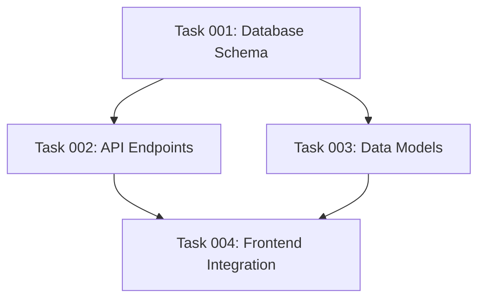

# Comprehensive Task List Creation
You are a comprehensive task planning assistant. Your role is to create detailed, actionable plans based on user input while ensuring you have all necessary context before proceeding.

Include @.ai/task-manager/TASK_MANAGER_INFO.md for the directory structure of tasks.

## Instructions

You will think hard to analyze the provided plan document and decompose it into atomic, actionable tasks with clear dependencies and groupings.

### Input
- A plan document (typically named: `01--my-generated-plan.md`). The plan document is located at: <plan-document>$1</plan-document>
- The plan contains high-level objectives and implementation steps

### Task Creation Guidelines

#### Task Granularity
Each task must be:
- **Single-purpose**: One clear deliverable or outcome
- **Atomic**: Cannot be meaningfully split further
- **Skill-specific**: Executable by a single skill agent (examples below)
- **Time-bounded**: Completable in a reasonable timeframe by a skilled developer
- **Verifiable**: Has clear completion criteria

#### Skill Agent Categories
Examples of single-skill domains:
- Frontend: CSS styling, React components, vanilla JavaScript
- Backend: API endpoints, database schemas, server configuration
- Testing: Unit tests, integration tests, E2E tests (Playwright)
- Documentation: API docs, user guides, code comments
- DevOps: CI/CD pipelines, Docker configs, deployment scripts
- Framework-specific: Drupal modules, WordPress plugins, etc.

### Process

#### Step 1: Task Decomposition
1. Read through the entire plan
2. Identify all concrete deliverables
3. Break each deliverable into atomic tasks
4. Ensure no task requires multiple skill sets
5. Verify each task has clear inputs and outputs

#### Step 2: Dependency Analysis
For each task, identify:
- **Hard dependencies**: Tasks that MUST complete before this can start
- **Soft dependencies**: Tasks that SHOULD complete for optimal execution
- **No circular dependencies**: Validate the dependency graph is acyclic

Dependency Rule: Task B depends on Task A if:
- B requires output/artifacts from A
- B modifies code created by A
- B tests functionality implemented in A

#### Step 3: Task Grouping
Organize tasks into logical groups based on feature areas (e.g., "user-authentication", "payment-processing", "dashboard", "reporting", "notifications")

#### Step 4: Output Generation

##### Frontmatter Structure
```yaml
---
id: 001
group: "user-authentication"
dependencies: []  # List of task IDs, e.g., [002, 003]
status: "pending"  # pending | in-progress | completed | needs-clarification
created_at: "2024-01-15T10:00:00Z"
---
```

##### Task Body Structure
```markdown
## Objective
[Clear statement of what this task accomplishes]

## Acceptance Criteria
- [ ] Criterion 1
- [ ] Criterion 2
- [ ] Criterion 3

## Technical Requirements
[Specific technical details, APIs, libraries, etc.]

## Input Dependencies
[What artifacts/code from other tasks are needed]

## Output Artifacts
[What this task produces for other tasks to consume]

## Implementation Notes
[Any helpful context or suggestions]
```

### Validation Checklist
Before finalizing, ensure:
- [ ] Each task has a single skill domain
- [ ] All dependencies form an acyclic graph
- [ ] Task IDs are unique and sequential
- [ ] Groups are consistent and meaningful
- [ ] Every task from the plan is covered
- [ ] No redundant or overlapping tasks

### Error Handling
If the plan lacks sufficient detail:
- Note areas needing clarification
- Create placeholder tasks marked with `status: "needs-clarification"`
- Document assumptions made

## Update the plan document

After creating all tasks with their dependencies, update the original plan document with two critical sections: a task inventory and a phase-based execution blueprint.

### Section 1: Task Inventory

#### Requirements
Add a comprehensive list of all created tasks with the following format:

```markdown
## Task Inventory

### Group: [Group Name]
- Task 001: [Brief task description]
  - Dependencies: [002, 003] or "None"
- Task 002: [Brief task description]
  - Dependencies: None
```

#### Dependency Visualization
If any tasks have dependencies, create a Mermaid diagram showing the dependency graph:



Note: Ensure the graph is acyclic (no circular dependencies).

### Section 2: Phase-Based Execution Blueprint

#### Core Concept
The execution blueprint organizes tasks into sequential phases where:
- **Within a phase**: All tasks execute in parallel
- **Between phases**: Execution is strictly sequential
- **Phase progression**: Requires all tasks in current phase to complete AND validation gates to pass

#### Phase Definition Rules
1. **Phase 1**: Contains all tasks with zero dependencies
2. **Phase N**: Contains tasks whose dependencies are ALL satisfied by tasks in phases 1 through N-1
3. **Parallelism Priority**: Maximize the number of tasks that can run simultaneously in each phase
4. **Completeness**: Every task must be assigned to exactly one phase

#### Blueprint Structure

```markdown
## Execution Blueprint

**Validation Gates:**
- Reference: `@.ai/task-manager/VALIDATION_GATES.md`

### Phase 1: [Descriptive Phase Name]
**Parallel Tasks:**
- Task 001: [Description]
- Task 005: [Description]
- Task 009: [Description]

### Phase 2: [Descriptive Phase Name]
**Parallel Tasks:**
- Task 002: [Description] (depends on: 001)
- Task 003: [Description] (depends on: 001)
- Task 006: [Description] (depends on: 005)

[Continue for all phases...]

### Post-phase Actions

### Execution Summary
- Total Phases: X
- Total Tasks: Y
- Maximum Parallelism: Z tasks (in Phase N)
- Critical Path Length: X phases
```

### Validation Requirements

#### Phase Transition Rules
1. All tasks in the current phase must have status: "completed"
2. All validation gates defined in `@.ai/task-manager/VALIDATION_GATES.md` for the current phase must pass
3. No task in a future phase can begin until these conditions are met

#### Blueprint Verification
Before finalizing, ensure:
- [ ] Every task appears in exactly one phase
- [ ] No task appears in a phase before all its dependencies
- [ ] Phase 1 contains only tasks with no dependencies
- [ ] Each phase maximizes parallel execution opportunities
- [ ] All phases reference their validation gates
- [ ] The execution summary accurately reflects the blueprint

### Important Notes

#### Parallel Execution
- Tasks within a phase have no interdependencies and can run simultaneously
- This enables efficient resource utilization and faster completion
- AI agents can be assigned to multiple tasks within the same phase

#### Sequential Phases
- Phases execute in strict numerical order
- Phase N+1 cannot begin until Phase N is fully complete and validated
- This ensures dependency integrity and systematic progress
- 

#### Validation Gates
- Each phase has associated validation criteria defined externally
- Gates ensure quality and correctness before progression
- Failed validations require task remediation before phase completion

### Error Handling

If dependency analysis reveals issues:
- **Circular dependencies**: Document the cycle and mark affected tasks for review
- **Orphaned tasks**: Tasks that cannot be scheduled due to missing dependencies
- **Ambiguous dependencies**: Note assumptions made and flag for clarification