# 🏗️ How It Works

AI Task Manager transforms chaotic AI development into structured, manageable workflows through **progressive refinement**, **context isolation**, and **validation gates**.

## The Core Problem

Traditional AI assistant "plan mode" features attempt to plan AND execute in a single continuous conversation, leading to:

**Context Overload**
```
[User Request + Planning + Task 1 + Task 2 + ... + Task N] → AI loses track
```

**No Scope Control**
- AI adds "nice-to-have" features not requested
- Plans expand beyond original requirements
- Difficult to maintain focus

**Missing Validation**
- Plans immediately proceed to execution
- No opportunity for human review
- Mistakes in planning compound during implementation

## The AI Task Manager Solution

### Three-Phase Progressive Refinement

AI Task Manager introduces **mandatory human review gates** between distinct phases:

```mermaid
flowchart TD
    A[User Request] --> B[📝 Phase 1: Planning]
    B --> C{Human Review}
    C --> D[📋 Phase 2: Task Generation]
    D --> E{Human Review}
    E --> F[🚀 Phase 3: Execution]
    F --> G[✅ Validated Output]

    B --> B1[Requirements<br/>Clarification]
    B --> B2[Architecture<br/>Decisions]
    B --> B3[Risk<br/>Assessment]

    D --> D1[Atomic Task<br/>Breakdown]
    D --> D2[Dependency<br/>Mapping]
    D --> D3[Skill<br/>Assignment]

    F --> F1[Parallel<br/>Execution]
    F --> F2[Quality<br/>Gates]
    F --> F3[Progress<br/>Tracking]

    style A fill:#ffebee
    style C fill:#fff3e0
    style E fill:#fff3e0
    style G fill:#e8f5e8
    style B fill:#e3f2fd
    style D fill:#f3e5f5
    style F fill:#e8f5e8
```



### Phase 1: Strategic Planning

**Input**: User request with project requirements

**Process**:
1. AI asks clarifying questions
2. Documents requirements and constraints
3. Proposes technical approach
4. Identifies risks and success criteria

**Output**: Comprehensive plan document

**Human Review Gate**:
- Verify requirements captured accurately
- Remove unnecessary features (YAGNI enforcement)
- Adjust technical approach if needed
- Approve or request changes

**Why This Matters**:
- Catches scope creep before any code is written
- Ensures AI understands actual requirements
- Allows human expertise to guide technical decisions

### Phase 2: Task Decomposition

**Input**: Approved plan document

**Process**:
1. AI breaks plan into atomic tasks (1-2 skills each)
2. Maps dependencies between tasks
3. Assigns skills for specialized agent deployment
4. Generates execution blueprint with phases

**Output**: Task documents + dependency graph + execution blueprint

**Human Review Gate**:
- Review all task acceptance criteria
- Remove tasks outside core scope
- Adjust dependencies if needed
- Verify parallelization opportunities

**Why This Matters**:
- Final opportunity to control scope
- Ensures tasks are right-sized (not too complex or too simple)
- Confirms implementation approach before execution

### Phase 3: Phased Execution

**Input**: Approved tasks and execution blueprint

**Process**:
1. Execute tasks phase by phase
2. Run independent tasks in parallel within each phase
3. Validate with POST_PHASE hook after each phase
4. Commit results and move to next phase

**Output**: Working implementation with commits per phase

**Validation Gates** (Configurable via POST_PHASE hook):
- Linting passes
- Tests pass
- Coverage thresholds met
- Security scans pass
- Documentation updated

**Why This Matters**:
- Quality enforced incrementally, not at the end
- Easy to identify which phase introduced issues
- Git commits create natural rollback points

## Design Principles

### 1. Context Isolation

**Problem**: AI assistants struggle with large context windows

**Solution**: Each phase operates with focused context

**Phase 1 Context**:
```
User Request + Clarifying Questions + Architecture Knowledge
```

**Phase 2 Context**:
```
Plan Document + Task Breakdown Rules + Dependency Logic
```

**Phase 3 Context** (Per Task):
```
Single Task + Dependencies + Acceptance Criteria + Project Context
```

**Benefit**: AI maintains focus and quality throughout implementation, even on complex projects

### 2. Progressive Disclosure

**Principle**: Provide information at the right time, not all at once

**Implementation**:
- **Beginners**: Start with basic workflow (create plan → generate tasks → execute)
- **Intermediate**: Add customization (hooks for quality gates)
- **Advanced**: Customize templates, create workflow patterns

**Navigation Structure**:
```
Getting Started → Core Concepts → Customization & Extension
```

**Benefit**: Users aren't overwhelmed; they learn incrementally

### 3. Validation Gates (YAGNI Enforcement)

**Problem**: AI assistants tend to over-engineer and add unnecessary features

**Solution**: Multiple checkpoints that ask "Is this explicitly requested?"

**Validation Points**:
1. **PRE_PLAN Hook**: Reminds AI to avoid gold-plating
2. **Plan Review**: Human removes unrequested features
3. **Task Review**: Human deletes unnecessary tasks
4. **POST_PHASE Hook**: Quality gates ensure each phase meets standards

**Benefit**: Ships exactly what's needed, not what "might be nice"

### 4. Skill-Based Decomposition

**Problem**: Generalist AI handling all aspects leads to diluted quality

**Solution**: Tasks tagged with 1-2 skills, specialized agents deployed per skill

**Example**:
```yaml
# Task 1
skills: ["database", "schema-design"]
→ Database specialist agent

# Task 2
skills: ["react-components", "ui"]
→ Frontend specialist agent

# Task 3
skills: ["api-endpoints", "authentication"]
→ Backend specialist agent
```

**Benefit**:
- Deeper domain expertise per task
- Better code quality from specialized context
- Parallel execution of independent tasks

### 5. Human-in-the-Loop at Decision Points

**Principle**: AI generates options, humans make decisions

**Decision Points**:
- After planning (approve technical approach)
- After task generation (approve scope and breakdown)
- Between phases (verify quality before continuing)

**Benefit**: Combines AI speed with human judgment

## Extensibility Architecture

AI Task Manager is built for customization through three extension points:

### 1. Hooks System

Seven lifecycle hooks inject custom logic:

```
PRE_PLAN → Planning guidance
PRE_PHASE → Phase preparation
PRE_TASK_ASSIGNMENT → Agent selection
POST_PLAN → Plan validation
POST_TASK_GENERATION_ALL → Task refinement
POST_PHASE → Quality gates
POST_ERROR_DETECTION → Error handling
```

**Why Hooks Matter**:
- Encode project-specific quality gates
- Integrate with existing tools (CI/CD, testing, deployment)
- Enforce organizational standards
- Adapt workflow to team needs

**Example Use Cases**:
- POST_PHASE: Run TypeScript compilation, test suite, coverage check
- PRE_PLAN: Include architecture guidelines from design docs
- POST_ERROR_DETECTION: Send Slack notifications on failures

See [Customization Guide]() for detailed hook examples.

### 2. Templates System

Five customizable templates structure artifacts:

**Plan Template**: Captures requirements, architecture, risks, success criteria
**Task Template**: Defines acceptance criteria, dependencies, implementation notes
**Blueprint Template**: Organizes phases and parallelization
**Execution Summary**: Documents results and learnings
**Fix Broken Tests**: Enforces test integrity

**Why Templates Matter**:
- Consistent structure across all plans and tasks
- Easily add project-specific sections
- Team alignment on documentation standards

**Example Customizations**:
- Add security checklist to task template
- Include performance requirements section in plan template
- Add compliance considerations for regulated industries

See [Customization Guide]() for template modification examples.

### 3. Configuration Files

**TASK_MANAGER.md**: Project context for AI assistants
- Tech stack and frameworks
- Coding standards
- Architecture decisions
- Links to documentation

**Why Configuration Matters**:
- AI assistants reference this for every task
- Ensures consistency across all implementations
- Documents decisions for team members

## Value Proposition

### Organized Execution

```mermaid
flowchart LR
    A[Complex Project] --> B[AI Task Manager]
    B --> C[📋 Structured Plans]
    B --> D[⏰ Phased Execution]
    B --> E[✅ Quality Gates]
    B --> F[🔄 Consistent Process]

    style A fill:#ffebee
    style B fill:#fff3e0
    style C fill:#e8f5e8
    style D fill:#e8f5e8
    style E fill:#e8f5e8
    style F fill:#e8f5e8
```



**Benefits**:
- **Clear Roadmap**: Know exactly what will be built
- **Predictable Timeline**: Phase-based progress tracking
- **Quality Assurance**: Validation gates prevent rework
- **Team Alignment**: Shared plans and task documents
- **Knowledge Capture**: Plans document decisions and rationale

### Time Savings

**Eliminated**:
- Back-and-forth clarifications (clarified upfront in planning)
- Rework from misunderstood requirements (plan review catches this)
- Debugging scope creep (removed during task review)
- Finding where AI went off-track (phase-based commits pinpoint issues)

**Gained**:
- Parallel execution of independent tasks
- Reusable plan patterns for similar projects
- Automated quality validation via hooks

### Consistent Process

**Every Project**:
1. Create plan
2. Review and refine scope
3. Generate tasks
4. Review and adjust breakdown
5. Execute with quality gates
6. Archive for future reference

**Benefits**:
- Onboard new team members faster (standard workflow)
- Reduce decision fatigue (process is defined)
- Improve over time (refine hooks and templates)

## Technical Foundation

AI Task Manager leverages research-backed principles:

**Cognitive Load Theory**: Phased approach reduces AI context overload, resulting in 25% improvement in task completion accuracy (research-validated)

**Progressive Refinement**: Multiple validation gates catch issues early, reducing rework by enforcing scope control at each phase

**Mixture of Agents (MoA)**: Specialized agents for each task outperform generalist approaches—research shows collaborative multi-agent systems produce higher quality outputs

**Skill-Based Decomposition**: Maximum 2 skills per task ensures focused execution and enables parallel processing

**Human-in-the-Loop**: Strategic human input at decision points maximizes quality while maintaining AI execution speed

## Next Steps

- **[Customization Guide]()**: Learn to customize hooks, templates, and workflows
- **[Workflow Patterns]()**: Advanced patterns for complex projects
- **[Basic Workflow]()**: Day-to-day usage guide
- **[Features]()**: Complete feature overview
