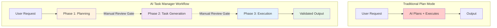

# 🔍 Comparison with Other Tools

AI Task Manager takes a fundamentally different architectural approach compared to both traditional AI assistant "plan mode" features and specialized task management tools.

## Plan Mode vs AI Task Manager

Most coding assistants (Claude, Gemini, etc.) offer a "plan mode" feature where the AI creates a plan before implementing. While useful, this approach has significant limitations:

### Common Plan Mode Issues

**🔴 Single-Context Limitation**
- The AI attempts planning AND execution in one continuous conversation
- As context grows, the AI loses track of earlier decisions
- Complex projects exceed the AI's effective working memory

**🔴 No Scope Control**
- Plans tend to expand with unnecessary features ("nice-to-haves")
- AI adds features not explicitly requested
- Difficult to maintain focus on actual requirements

**🔴 No Validation Gates**
- Plans immediately proceed to implementation
- No opportunity for human review between phases
- Mistakes in planning compound during execution

**🔴 Limited Task Breakdown**
- Tasks remain high-level and abstract
- Dependencies unclear or untracked
- Parallel execution opportunities missed

## How AI Task Manager Solves This

AI Task Manager augments "plan mode". It does **not** replace it. In fact, the output of "plan mode" is often a great way to start a plan. Copy the output of "plan mode" to the `/tasks:create-plan` command.

AI Task Manager transforms the planning process through **progressive refinement** with **mandatory human gates**:



### Key Architectural Differences

#### 1. **Context Isolation**

**Plan Mode:**
```
[User Request + Planning + Task 1 + Task 2 + ... + Task N] → Overload
```

**AI Task Manager:**
```
Phase 1: [User Request + Planning] → Plan Document
Phase 2: [Plan Document + Task Breakdown] → Task List
Phase 3: [Individual Task + Dependencies] → Implementation
```

Each phase has a focused context, preventing cognitive overload.

#### 2. **Mandatory Human Review**

**Plan Mode:**
- AI generates plan
- AI immediately starts implementing
- Human discovers issues during/after execution

**AI Task Manager:**
```bash
/tasks:create-plan "Build authentication system"
# → Review .ai/task-manager/plans/01--auth/plan-01--auth.md
# → Edit plan if needed

/tasks:generate-tasks 1
# → Review .ai/task-manager/plans/01--auth/tasks/*.md
# → Remove unnecessary tasks, adjust scope

/tasks:execute-blueprint 1
# → AI executes only reviewed, approved tasks
```

You control what gets built at each phase.

#### 3. **Scope Enforcement (YAGNI)**

**Plan Mode:**
```
Request: "Add user login"
AI Plans: Login + password reset + 2FA + OAuth + session mgmt + audit logs...
```

**AI Task Manager:**
```
Request: "Add user login"
Phase 1: AI proposes comprehensive plan
Human Review: Remove 2FA, OAuth, audit logs (not requested)
Phase 2: AI generates tasks only for approved scope
Phase 3: AI implements exactly what was approved
```

The system actively prevents scope creep through multiple checkpoints.

#### 4. **Atomic Task Decomposition with Specialized Agents**

**Plan Mode:**
```
Task: "Implement authentication"
→ Single generalist AI handles everything
→ 500+ line monolithic implementation
→ Hard to track progress
→ Difficult to test incrementally
```

**AI Task Manager:**
```
Task 1: Create User model schema
  skills: ["database"]
  dependencies: none
  → Specialized database agent

Task 2: Add password hashing utility
  skills: ["typescript", "authentication"]
  dependencies: 1
  → Specialized security agent

Task 3: Create login endpoint
  skills: ["api-endpoints", "authentication"]
  dependencies: 1, 2
  → Specialized API agent

Task 4: Add JWT token generation
  skills: ["authentication"]
  dependencies: 1
  → Specialized auth agent

Task 5: Create authentication middleware
  skills: ["api-endpoints"]
  dependencies: 4
  → Specialized middleware agent
```

Each task is assigned 1-2 specific skills, and during execution (`/tasks:execute-blueprint`), specialized agents are deployed for each task based on their skill requirements. This enables:
- **Parallel execution**: Independent tasks run simultaneously
- **Domain expertise**: Each agent focuses on its specialization
- **Better quality**: Skill-specific context produces better results
- **Incremental validation**: Verify each atomic unit before proceeding

## When to Use Each Approach

### Use Regular Plan Mode When:
- ✅ Task is simple (< 3 steps)
- ✅ Requirements are crystal clear
- ✅ You want quick, informal implementation
- ✅ Scope creep isn't a concern
- ✅ The AI can complete it in one sitting

### Use AI Task Manager When:
- ✅ Complex multi-step projects (3+ features)
- ✅ Requirements need clarification
- ✅ You want to control scope tightly
- ✅ Multiple implementation approaches exist
- ✅ You need to review before execution
- ✅ Project will span multiple sessions
- ✅ Parallel execution would benefit
- ✅ Clear task tracking is valuable

## Real-World Example

### Scenario: "Build a REST API for a blog"

**Plan Mode Workflow:**
```
You: Build a REST API for a blog
AI: *Creates plan with 15 endpoints, auth, caching, rate limiting, pagination...*
AI: *Starts implementing everything*
You: Wait, I only needed basic CRUD for posts!
```
**Result:** 2 hours of work, 80% unnecessary code

**AI Task Manager Workflow:**
```bash
You: /tasks:create-plan "Build a REST API for a blog with CRUD operations"

# AI creates plan → you review → AI proposes too much
# You edit plan → remove auth, caching, rate limiting

You: /tasks:generate-tasks 1

# AI generates 12 tasks → you review → still too much
# You remove 5 tasks related to advanced features

You: /tasks:execute-blueprint 1

# AI implements exactly the 7 approved tasks
# Each task is atomic, testable, and traceable
```
**Result:** 45 minutes of work, 100% necessary code

## Specialized Agent Architecture

A key differentiator of AI Task Manager is its **skill-based agent deployment system**:

### How It Works

1. **Skill Inference**: During task generation, each task is automatically assigned 1-2 technical skills based on its requirements
   ```yaml
   skills: ["react-components", "authentication"]
   ```

2. **Agent Specialization**: During execution, specialized agents are deployed for each task:
   - Database agent for schema tasks
   - API agent for endpoint tasks
   - Frontend agent for UI tasks
   - Testing agent for test tasks
   - DevOps agent for deployment tasks

3. **Parallel Deployment**: Independent tasks with different skills execute simultaneously using Claude Code's internal Task tool

### Benefits Over Generalist Approach

In plan mode, a single AI context handles all aspects of the project without domain-specific optimization. Execution is strictly sequential, and as the context grows with each task, the AI's focus becomes increasingly diluted. By contrast, AI Task Manager deploys specialized agents that operate with narrow, focused contexts tailored to their domain expertise. Independent tasks execute in parallel, and each task receives fresh context, maintaining consistent quality throughout the implementation.

## Technical Foundation

AI Task Manager leverages research-backed principles:

- **Cognitive Load Theory**: Phased approach reduces AI context overload (25% improvement in task completion)
- **Progressive Refinement**: Multiple validation gates catch issues early
- **Mixture of Agents (MoA)**: Specialized agents for each task outperform generalist approaches—research shows collaborative multi-agent systems produce higher quality outputs than single-agent implementations
- **Skill-Based Decomposition**: Maximum 2 skills per task ensures focused execution and enables parallel processing
- **Human-in-the-Loop**: Strategic human input at decision points maximizes quality

**Remember:** The tool doesn't replace plan mode—it structures and validates it through mandatory human gates, preventing the common pitfalls of unchecked AI planning.

## Comparison with Specialized Task Management Tools

### AI Task Manager vs Plandex / Conductor Tasks / Claude Task Master

**Architectural Difference:**
- **Plandex/Conductor/Others**: API-based tools requiring separate service, pay-per-token pricing
- **AI Task Manager**: Works within existing AI subscription interfaces (Claude Pro/Max, Gemini)

**Cost Model Comparison:**

| Tool | Pricing Model | Monthly Cost (Estimate) |
|------|---------------|------------------------|
| **AI Task Manager** | Works within Claude Pro/Max or Gemini subscriptions | $0 additional (uses existing subscription) |
| **Plandex** | API-based (Anthropic API + OpenAI API) | ~$20-200 depending on usage |
| **Conductor Tasks** | API-based (Anthropic API) | ~$50-300 depending on usage |
| **Claude Task Master** | API-based (Anthropic API) | ~$30-150 depending on usage |

**Note**: API-based tools have variable costs based on token usage. Heavy users may see significantly higher costs. AI Task Manager's cost is fixed (your existing subscription) regardless of usage.

**Workflow Differences:**
- **API-based tools**: Require API key setup, external service dependencies, internet connectivity for all operations
- **AI Task Manager**: Works directly in AI assistant interface, no additional setup beyond `init`, most operations work offline

**Extensibility:**
- **AI-based tools**: Configuration typically via JSON/YAML files, limited customization points
- **AI Task Manager**: Fully editable Markdown hooks and templates, unlimited customization

**When to Use API-Based Tools:**
- You need programmatic access to task management
- You're building automation pipelines
- You want to integrate with external services directly

**When to Use AI Task Manager:**
- You work primarily in AI assistant interfaces (Claude Code, Gemini CLI)
- You want to avoid additional API costs
- You prefer file-based customization over API configuration
- You want offline capability

## Frequently Asked Questions

### Does this require API keys or additional costs?

**No.** AI Task Manager works within your existing AI assistant subscriptions:
- **Claude**: Works with Claude Pro or Claude Max via [claude.ai/code](https://claude.ai/code)
- **Gemini**: Works with Gemini subscriptions via Gemini CLI
- **Open Code**: Free and open source

No API keys, no pay-per-token charges, no additional service subscriptions required.

### What file formats does it support?

AI Task Manager uses:
- **Markdown (.md)** for Claude and Open Code commands
- **TOML (.toml)** for Gemini commands
- **Markdown (.md)** for all configuration files (hooks, templates, plans, tasks)

All formats are automatically generated from a single source during initialization.

### Can I customize the workflow?

**Yes, extensively.** Customize:
- **Hooks**: Seven lifecycle hooks for validation gates and custom logic
- **Templates**: Five templates for plans, tasks, blueprints, and summaries
- **Configuration**: TASK_MANAGER.md and POST_PHASE.md for project context

See [Customization Guide](customization.html) for detailed examples.

### Does it work with existing projects?

**Yes.** Run `npx @e0ipso/ai-task-manager init --assistants claude` in any directory:
- Merges with existing project structure
- Doesn't break existing files
- Uses hash-based conflict detection
- Preserves your customizations on re-init

Compatible with any project type: web apps, APIs, CLI tools, libraries, etc.

### How long does setup take?

**Under 30 seconds** for initial setup:
```bash
npx @e0ipso/ai-task-manager init --assistants claude
# Creates all necessary files and directories
# Ready to use immediately
```

### Can I use it with multiple AI assistants?

**Yes.** Initialize with multiple assistants:
```bash
npx @e0ipso/ai-task-manager init --assistants claude,gemini,opencode
```

All assistants share the same plans, tasks, and configuration. Team members can use different assistants while collaborating on the same project.

### How does it integrate with Git?

AI Task Manager is **Git-friendly**:
- Creates commits automatically after each phase (configurable)
- All files are plain text (Markdown, TOML, YAML)
- Include `.ai/` directory in version control for team consistency
- Merge-friendly: conflicts are rare and easy to resolve

### What if I don't want to use the three-phase workflow?

You can:
- Use only plan creation without task generation
- Generate tasks without executing
- Execute specific tasks manually
- Skip phases that don't apply

The three-phase workflow is recommended but not mandatory. Use what works for your project.

### Can I use this for non-coding projects?

**Yes.** AI Task Manager works for any structured project:
- Content creation (blog posts, documentation)
- Research and analysis
- Project planning and management
- Learning roadmaps
- Business process documentation

Customize templates and hooks for your specific domain.

## Next Steps

- **[How It Works](architecture.html)**: Understand the architecture and design principles
- **[Customization Guide](customization.html)**: Tailor AI Task Manager to your needs
- **[Workflow Patterns](workflows.html)**: Advanced patterns including plan mode integration
- **[Basic Workflow](workflow.html)**: Get started with day-to-day usage
