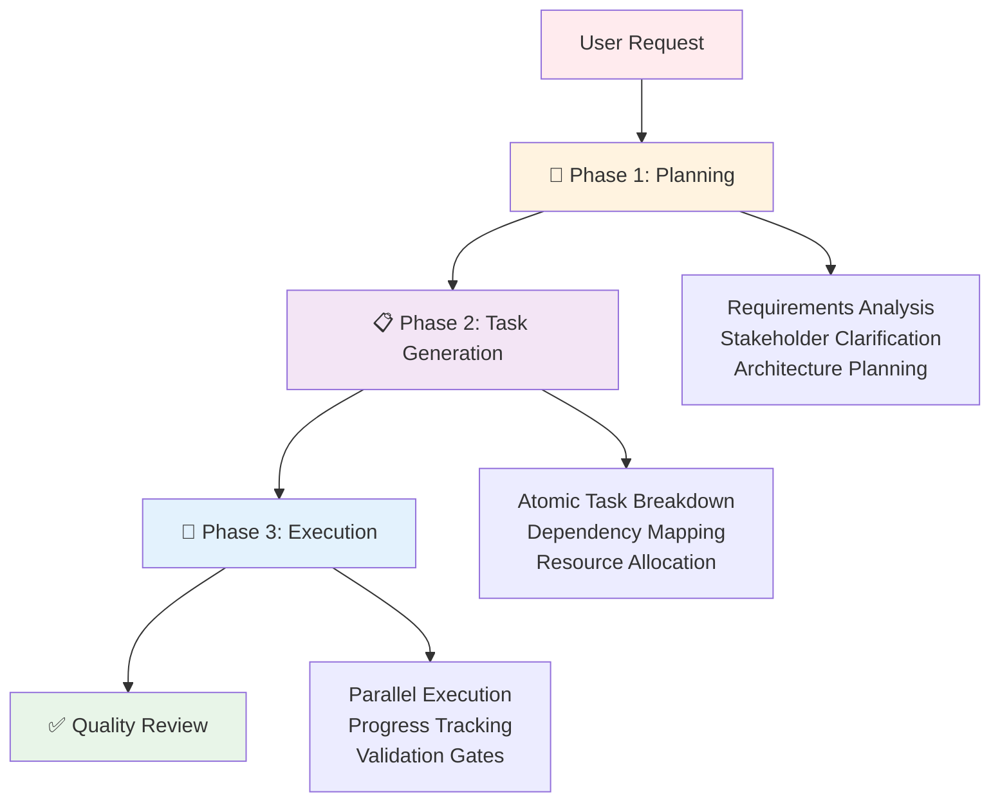

# ✨ Features

AI Task Manager provides comprehensive tools for structured AI-assisted development workflows with a focus on customization and extensibility.

## 🔧 Configuration & Customization

**Tailor every aspect of the task management workflow to your project's specific needs.**

### Project Context
- **TASK_MANAGER.md**: Editable project context and guidelines that inform AI assistants about your tech stack, coding standards, and project-specific requirements
- **POST_PHASE.md**: Custom validation criteria and quality gates executed after each phase completion
- **Template Customization**: Modify plan and task templates to include project-specific sections, acceptance criteria, and workflow steps

### Extensibility Framework
- **Hook System**: Seven lifecycle hooks for injecting custom logic at key workflow points (PRE_PLAN, PRE_PHASE, POST_PHASE, POST_PLAN, POST_TASK_GENERATION_ALL, PRE_TASK_ASSIGNMENT, POST_ERROR_DETECTION)
- **Custom Validation Gates**: Add project-specific quality checks, security scans, performance tests, or documentation requirements
- **Integration Points**: Connect with existing CI/CD pipelines, testing frameworks, or development tools
- **Workflow Patterns**: Create and share reusable workflow patterns for common project types

**Learn more**: See the [Customization Guide](customization.html) for detailed examples and real-world scenarios.

## 📋 Template System

**Consistent structure with flexibility for project-specific needs.**

### Core Templates
- **PLAN_TEMPLATE.md**: Strategic planning with requirement analysis, architecture decisions, and risk considerations
- **TASK_TEMPLATE.md**: Task structure with acceptance criteria, dependencies, and implementation notes
- **BLUEPRINT_TEMPLATE.md**: Phase-based execution plans with dependency graphs and parallelization strategies
- **EXECUTION_SUMMARY_TEMPLATE.md**: Post-completion documentation capturing results and learnings

### Template Features
- **YAML Frontmatter**: Structured metadata for plans, tasks, and execution tracking
- **Customizable Sections**: Add domain-specific content while preserving core structure
- **Variable Substitution**: Dynamic content based on context (plan ID, task ID, arguments)
- **Format Adaptation**: Automatic conversion between Markdown (Claude, Open Code) and TOML (Gemini)

**Learn more**: See the [Customization Guide](customization.html) for template modification examples.

## 🤝 Multi-Assistant Support

Configure support for multiple coding assistants simultaneously:

- **🎭 Claude**: Anthropic's Claude AI via [claude.ai/code](https://claude.ai/code) - Markdown-based commands
- **💎 Gemini**: Google's Gemini AI via CLI - TOML-based commands
- **📝 Open Code**: Open source assistants - Markdown-based commands

All assistants share the same task management structure while using assistant-specific command formats. Initialize multiple assistants in a single project for team flexibility.

## 🔄 Workflow Orchestration

### Three-Phase Progressive Refinement



### Progressive Refinement Benefits
- **Context Isolation**: Each phase focuses on specific objectives without cognitive overload
- **Validation Gates**: Quality checkpoints between phases catch issues early
- **Iterative Improvement**: Human review and feedback loops at each phase
- **Scope Control**: Built-in mechanisms prevent feature creep through YAGNI enforcement

**Learn more**: See the [Architecture](architecture.html) page for design principles and [Workflow Patterns](workflows.html) for advanced usage.

## 🎯 Task Management

### Atomic Task Decomposition
- **Single Responsibility**: Each task addresses one clear objective
- **Skill-Based Assignment**: Tasks tagged with 1-2 technical skills for specialized agent deployment
- **Dependency Tracking**: Automatic dependency resolution and sequencing
- **Complexity Analysis**: Automatic scoring identifies tasks requiring subdivision

### Quality Assurance
- **Acceptance Criteria**: Checkbox-based validation requirements for each task
- **Progress Tracking**: Real-time status updates (pending → in_progress → completed/failed)
- **Error Handling**: Graceful failure recovery with remediation workflows via POST_ERROR_DETECTION hook
- **Test Integrity**: fix-broken-tests command enforces proper test fixes, not workarounds

### Progress Monitoring & Dashboard

Real-time visibility into your project's task management state:


**Dashboard Features:**
- Summary statistics: total plans, active/archived counts, completion rates
- Active plans view with visual progress bars
- Unfinished task alerts for archived plans
- Color-coded terminal output for easy scanning

**Usage:**
```bash
npx @e0ipso/ai-task-manager status
```

## 🏗️ Workspace Management

### Intelligent Initialization
- **Non-destructive Setup**: Detects existing project structures and merges safely
- **File Conflict Detection**: Hash-based tracking monitors user customizations
- **Interactive Resolution**: Shows unified diffs and prompts for conflicts
- **Force Mode**: `--force` flag bypasses prompts for automation scenarios
- **Smart Updates**: Automatically updates unchanged template files

### Directory Structure
Organized workspace with clear separation of concerns:
```
.ai/task-manager/       # Shared configuration
├── plans/              # Active plans and tasks
├── archive/            # Completed plans (preserved history)
├── config/             # Customizable hooks and templates
└── .init-metadata.json # Conflict detection tracking

.claude/commands/       # Claude-specific commands (if configured)
.gemini/commands/       # Gemini-specific commands (if configured)
.opencode/commands/     # Open Code commands (if configured)
```

## 🚀 Performance & Scalability

### Optimized Execution
- **Parallel Processing**: Independent tasks within phases execute concurrently via Task tool
- **Specialized Agents**: Skill-based agent deployment provides domain-specific context
- **Resource Management**: Intelligent allocation of AI assistant capabilities
- **Incremental Updates**: Only process changes, not entire workflows

### Enhanced ID Generation
- **Performance Optimization**: Fast empty directory checks (90% case)
- **Comprehensive Validation**: Multi-source ID detection (directories, filenames, frontmatter)
- **Error Handling**: Graceful degradation with informative error messages
- **Debug Support**: `DEBUG=true` environment variable for troubleshooting

## 🔒 Security & Privacy

### Local-First Architecture
- **No External Dependencies**: All data stored locally on your machine
- **No Data Transmission**: Works entirely within AI assistant interfaces
- **Full Control**: Complete ownership of plans, tasks, and project information
- **Offline Capable**: Most operations work without internet connectivity

### Best Practices
- **Secure Configuration**: No hardcoded credentials or API keys
- **Version Control**: Include customized hooks/templates in repository for team consistency
- **Audit Trail**: Comprehensive logging of decisions and outcomes in plan/task documents
- **Environment-Specific Settings**: Separate configuration for development, staging, production

## 💰 Subscription-Based Model

### Works Within Existing AI Subscriptions
- No additional API keys required
- No pay-per-token charges
- No external service dependencies
- Maximize value from current AI investments (Claude Pro/Max, Gemini subscriptions)

### Resource Optimization
- Efficient prompt structuring through phased approach
- Targeted context isolation minimizes redundant information
- Reusable templates and patterns reduce setup overhead
- Cached plans and tasks enable quick iteration
