# ✨ Features

AI Task Manager provides comprehensive tools for structured AI-assisted development workflows.

## 🤝 Multi-Assistant Support

Configure support for multiple coding assistants simultaneously:

- **🎭 Claude**: Anthropic's Claude AI assistant via Claude Code
- **💎 Gemini**: Google's Gemini AI assistant via CLI
- **📝 Open Code**: Open source code assistant integration

## 📋 Template System

Built-in templates for different project types:

### Project Templates
- **Basic**: Simple project structure for small applications
- **Development**: Full development workflow with testing and CI/CD
- **Research**: Documentation and analysis-focused projects

### Command Templates
- **create-plan**: Strategic planning and requirement analysis
- **generate-tasks**: Task decomposition and dependency mapping  
- **execute-blueprint**: Implementation and execution workflows

## 🏗️ Workspace Management

### Intelligent Initialization
- Detects existing project structures
- Merges configurations safely
- Preserves existing files while updating templates
- Supports custom destination directories

### Format Adaptation
- **Markdown** format for Claude and Open Code
- **TOML** format for Gemini integration
- Automatic format conversion between assistants
- Consistent functionality across all formats

## 🔄 Workflow Orchestration

### Three-Phase Approach

```mermaid
flowchart TD
    A[User Request] --> B[📝 Phase 1: Planning]
    B --> C[📋 Phase 2: Task Generation]
    C --> D[🚀 Phase 3: Execution]
    D --> E[✅ Quality Review]
    
    B --> B1[Requirements Analysis<br/>Stakeholder Clarification<br/>Architecture Planning]
    C --> C1[Atomic Task Breakdown<br/>Dependency Mapping<br/>Resource Allocation]
    D --> D1[Parallel Execution<br/>Progress Tracking<br/>Validation Gates]
    
    style A fill:#ffebee
    style E fill:#e8f5e8
    style B fill:#fff3e0
    style C fill:#f3e5f5
    style D fill:#e3f2fd
```

### Progressive Refinement
- **Context Isolation**: Each phase focuses on specific objectives
- **Validation Gates**: Quality checkpoints between phases
- **Iterative Improvement**: Feedback loops for continuous refinement
- **Scope Control**: Built-in mechanisms to prevent feature creep

## 🎯 Task Management

### Atomic Task Decomposition
- **Single Responsibility**: Each task has one clear objective
- **Skill-Based Assignment**: Tasks matched to specific technical skills
- **Dependency Tracking**: Automatic dependency resolution and sequencing
- **Complexity Analysis**: Automatic scoring and decomposition of complex tasks

### Quality Assurance
- **Validation Criteria**: Predefined acceptance criteria for each task
- **Progress Tracking**: Real-time status updates and completion monitoring
- **Error Handling**: Graceful failure recovery and remediation workflows
- **Documentation**: Comprehensive logging of decisions and outcomes

## 🔧 Configuration & Customization

### Project Context
- **TASK_MANAGER.md**: Editable project context and guidelines
- **POST_PHASE.md**: Custom validation criteria and quality gates
- **Template Customization**: Modify templates for specific project needs

### Extensibility
- **Plugin Architecture**: Support for custom extensions
- **Hook System**: Custom scripts for lifecycle events
- **Integration Points**: APIs for external tool integration
- **Configuration Management**: Environment-specific settings

## 🚀 Performance & Scalability

### Optimized Execution
- **Parallel Processing**: Concurrent task execution within phases
- **Resource Management**: Intelligent allocation of AI assistant resources
- **Caching**: Optimized storage and retrieval of plans and tasks
- **Incremental Updates**: Only process changes, not entire workflows

### Monitoring & Analytics
- **Execution Metrics**: Track completion times and success rates
- **Resource Usage**: Monitor AI assistant utilization
- **Quality Metrics**: Measure output quality and consistency
- **Performance Insights**: Identify optimization opportunities

## 💰 Cost Efficiency

### No Additional API Costs
- Works within existing AI subscriptions
- No pay-per-token charges
- No external service dependencies
- Maximize value from current AI investments

### Resource Optimization
- Efficient prompt structuring reduces token usage
- Targeted queries minimize unnecessary API calls
- Reusable templates and patterns
- Smart caching reduces redundant operations

## 🔒 Security & Privacy

### Local-First Architecture
- All data stored locally on your machine
- No external data transmission required
- Full control over sensitive project information
- Works offline for most operations

### Best Practices
- Secure handling of configuration files
- No hardcoded credentials or secrets
- Environment-specific configuration management
- Audit trail for all operations