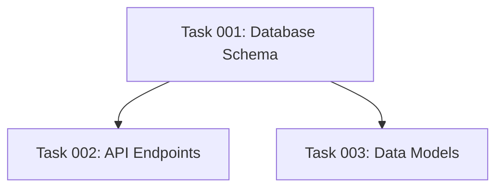

# 🎣 Hooks System

The AI Task Manager uses a hooks system to inject custom logic at specific points in the task management workflow. Hooks are Markdown files containing instructions that AI assistants execute during the workflow.

## Available Hooks

The system includes 6 hooks located in `.ai/task-manager/config/hooks/`:

### 1. PRE_PHASE Hook

**File**: `PRE_PHASE.md`

**Purpose**: Phase preparation logic executed before starting any phase execution.

**Key Functions**:
- Git branch management (creates feature branch from main if on main branch)
- Validates current repository state (checks for unstaged changes)  
- Task dependency validation using `check-task-dependencies.js` script
- Confirms no tasks are marked "needs-clarification"
- Verifies completed phases are actually complete

**Implementation Details**:
```bash
# Dependency checking logic from the hook
for TASK_ID in $PHASE_TASKS; do
    if ! node .ai/task-manager/config/scripts/check-task-dependencies.js "$1" "$TASK_ID"; then
        echo "ERROR: Task $TASK_ID has unresolved dependencies"
        exit 1
    fi
done
```

### 2. POST_PHASE Hook

**File**: `POST_PHASE.md`

**Purpose**: Validation gates executed after phase completion.

**Current Implementation** (minimal):
- Ensure code passes linting requirements
- Verify all tests are run locally and passing
- Create descriptive commit using conventional commits format

This is a simple hook that can be customized by users to add project-specific validation.

### 3. POST_PLAN Hook

**File**: `POST_PLAN.md`

**Purpose**: Plan validation and enhancement after initial plan creation.

**Key Functions**:

#### Context Analysis and Clarification
- Analyzes user request for: objective, scope, resources, success criteria, dependencies, technical requirements
- Asks targeted follow-up questions if critical context is missing
- Attempts to answer questions by inspecting codebase and documentation first

#### Plan Document Updates
After task generation, updates the plan with:

1. **Dependency Visualization** - Mermaid diagram showing task dependencies:


2. **Phase-Based Execution Blueprint** - Organizes tasks into sequential phases:
   - Tasks within a phase execute in parallel
   - Phases execute sequentially
   - Includes validation gates reference

### 4. POST_TASK_GENERATION_ALL Hook

**File**: `POST_TASK_GENERATION_ALL.md`

**Purpose**: Task complexity analysis and refinement after all tasks are generated.

**Complexity Scoring Matrix**:

| Dimension | 1-2 | 3-4 | 5-6 | 7-8 | 9-10 |
|-----------|-----|-----|-----|-----|------|
| **Technical** | Basic ops | Single tech | 2-3 techs | Multiple complex | Cutting-edge |
| **Decision** | No decisions | 1-2 minor | Trade-offs | Interdependent | Novel solutions |
| **Integration** | Single file | 2-3 files | Multi-module | Many systems | 15+ services |
| **Scope** | Atomic action | Small feature | Complete feature | Major feature | Entire subsystem |
| **Uncertainty** | Crystal clear | Minor ambiguity | Some clarification | Research required | Experimental |

**Composite Score Formula**: 
```
MAX(Technical×1.0, Decision×0.9, Integration×0.8, Scope×0.7, Uncertainty×1.1)
```

**Decomposition Rules**:
- Tasks with composite score ≥6 should be considered for decomposition
- Any dimension ≥8 requires mandatory decomposition
- Maximum 3 decomposition rounds per task
- Minimum 2-hour work per subtask

### 5. PRE_TASK_ASSIGNMENT Hook

**File**: `PRE_TASK_ASSIGNMENT.md`

**Purpose**: Agent selection based on task skills and available sub-agents.

**Process**:
1. Extracts `skills` array from task frontmatter
2. Checks for available sub-agents in assistant directories (`.claude/agents`, `.gemini/agents`, `.opencode/agents`)
3. Matches task skills to agent capabilities
4. Falls back to general-purpose agent if no match found

**Skills Extraction Script** (from the actual hook):
```bash
TASK_SKILLS=$(awk '
    /^---$/ { if (++delim == 2) exit }
    /^skills:/ {
        # Extract skills from YAML frontmatter
    }
' "$TASK_FILE")

# Check for sub-agents
for assistant_dir in .claude .gemini .opencode; do
    if [ -d "$assistant_dir/agents" ]; then
        echo "Available sub-agents detected"
    fi
done
```

### 6. POST_ERROR_DETECTION Hook

**File**: `POST_ERROR_DETECTION.md`

**Purpose**: Error handling procedures for task execution failures.

**Functions**:
- Updates task status to "failed" in frontmatter
- Documents validation gate failures
- Provides remediation steps
- Re-executes affected tasks after fixes
- Escalates persistent errors to users

**Task Status Update Script** (from the actual hook):
```bash
# Update task status to failed
awk '
    /^status:/ && delim == 1 {
        print "status: \"failed\""
        next
    }
    { print }
' "$TASK_FILE" > "$TEMP_FILE"
```

## How Hooks Work in Practice

### Workflow Integration

The hooks are referenced and executed at specific points in the slash commands:

1. **`/tasks:create-plan`** → Executes **POST_PLAN** hook for validation and clarification
2. **`/tasks:generate-tasks`** → Executes **POST_TASK_GENERATION_ALL** for complexity analysis
3. **`/tasks:execute-blueprint`** → Executes:
   - **PRE_PHASE** before each phase
   - **PRE_TASK_ASSIGNMENT** before assigning tasks
   - **POST_PHASE** after phase completion
   - **POST_ERROR_DETECTION** on failures

### Customization

All hooks are editable Markdown files in your project's `.ai/task-manager/config/hooks/` directory. Users can modify them to:

- Add project-specific validation rules
- Include custom quality gates
- Integrate with existing tools
- Implement organization standards

### Example Customization

For example, you could enhance the `POST_PHASE.md` hook for a React project:

```markdown
Ensure that:

- The code base is passing the linting requirements
- All tests are run locally, and they are passing  
- TypeScript compilation succeeds with no errors
- Test coverage is above 80%
- No high-severity npm audit vulnerabilities
- A descriptive commit for the phase was successfully created
```

## Important Notes

1. **Hooks are instructions, not executable scripts** - They contain instructions that the AI assistant interprets and executes
2. **Project-specific customization** - Hooks are copied to your project and can be modified
3. **Version control** - Include hooks in your repository to maintain consistency across the team
4. **Simplicity by design** - Hooks are intentionally simple to allow easy customization

The hooks system provides a balance between structure and flexibility, allowing teams to implement their specific requirements while maintaining the core workflow of the AI Task Manager.