# 🎣 Hooks System

The AI Task Manager uses a powerful **hooks system** to customize and extend workflow behavior at key points in the task management lifecycle. Hooks allow you to inject custom logic, validation, and processing steps into the core workflow without modifying the underlying system.

## 🧩 What Are Hooks?

Hooks are **Markdown files containing instructions** that are automatically executed by AI assistants at specific points during task management workflows. They act as **customizable checkpoints** that ensure quality, consistency, and project-specific requirements are met throughout the development process.

### Key Characteristics

- **Instruction-Based**: Written in Markdown with clear procedural instructions
- **AI-Executed**: Interpreted and executed by your AI assistant (Claude, Gemini, etc.)
- **Context-Aware**: Have access to current project state, task data, and workflow context
- **Customizable**: Can be modified to fit your specific project needs and standards

## 🔄 Hook Execution Flow


## 🔄 Complete Workflow with Manual Review Steps

The AI Task Manager includes **critical manual review checkpoints** to ensure quality and prevent scope creep:

```mermaid
flowchart TD
    A[📝 /tasks:create-plan] --> B[🎯 POST_PLAN Hook]
    B --> C[📋 Plan Generated]
    C --> D[👁️ **MANUAL REVIEW 1**<br/>Review & Edit Plan]
    D --> E{Plan Approved?}
    E -->|No| C
    E -->|Yes| F[📋 /tasks:generate-tasks]
    F --> G[🔍 POST_TASK_GENERATION Hook]
    G --> H[📋 Tasks Generated]
    H --> I[👁️ **MANUAL REVIEW 2**<br/>Review Task List]
    I --> J{Tasks Approved?}
    J -->|No| H
    J -->|Yes| K[🚀 /tasks:execute-blueprint]
    K --> L[⚡ PRE_PHASE Hook]
    L --> M[🔧 Task Execution]
    M --> N[✅ POST_PHASE Hook]
    N --> O[🎉 Implementation Complete]
    
    style D fill:#fff3e0,stroke:#ff9800,stroke-width:3px
    style I fill:#fff3e0,stroke:#ff9800,stroke-width:3px
    style E fill:#f3e5f5
    style J fill:#f3e5f5
    style O fill:#e8f5e8
```



### Why Manual Reviews Are Critical

**Manual Review 1 (After Plan Creation)**:
- **Prevent Misalignment**: Ensure the plan matches your actual intentions
- **Scope Validation**: Confirm the scope is appropriate and not too broad/narrow  
- **Context Addition**: Add missing technical details or constraints
- **Priority Setting**: Adjust task priorities based on business needs

**Manual Review 2 (After Task Generation)**:
- **Scope Creep Prevention**: Remove unnecessary or out-of-scope tasks
- **Resource Planning**: Ensure tasks are appropriately sized for available time
- **Dependency Validation**: Verify task dependencies make logical sense
- **Quality Standards**: Confirm tasks meet your project's quality requirements

## 📋 Available Hooks

### 1. **PRE_PHASE** Hook
**Location**: `.ai/task-manager/config/hooks/PRE_PHASE.md`

**Purpose**: Phase preparation and initialization

**When Executed**: Before starting any phase execution in the blueprint

**Key Responsibilities**:
- Git branch management (create feature branches from main)
- Validate current repository state
- Check for unstaged changes
- Initialize phase execution environment
- Validate task dependencies using dependency checking scripts

**Example Use Cases**:
- Ensure clean working directory before starting work
- Create feature branches with standardized naming
- Pre-flight checks for development environment

### 2. **POST_PHASE** Hook
**Location**: `.ai/task-manager/config/hooks/POST_PHASE.md`

**Purpose**: Phase completion validation and quality gates

**When Executed**: After all tasks in a phase are completed

**Key Responsibilities**:
- Run code linting and ensure compliance
- Execute full test suite and verify all tests pass
- Create descriptive commit messages using conventional commits
- Validate phase deliverables meet quality standards

**Example Use Cases**:
- Automated code quality checks
- Test suite execution
- Documentation updates
- Deployment preparation

### 3. **POST_PLAN** Hook  
**Location**: `.ai/task-manager/config/hooks/POST_PLAN.md`

**Purpose**: Plan validation, clarification, and enhancement

**When Executed**: After initial plan creation but before task generation

**Key Responsibilities**:
- **Context Analysis**: Validate objectives, scope, resources, and success criteria
- **Clarification Phase**: Ask targeted questions to fill information gaps
- **Dependency Visualization**: Create Mermaid diagrams showing task relationships
- **Execution Blueprint**: Generate phase-based execution plan with parallel task grouping

**Example Use Cases**:
- Ensure comprehensive requirement gathering
- Identify missing project context
- Create visual project roadmaps
- Optimize task execution for maximum parallelism

### 4. **POST_TASK_GENERATION_ALL** Hook
**Location**: `.ai/task-manager/config/hooks/POST_TASK_GENERATION_ALL.md`

**Purpose**: Task complexity analysis and decomposition

**When Executed**: After all tasks are generated for a plan

**Key Responsibilities**:
- **Complexity Scoring**: Evaluate tasks across 5 dimensions (Technical, Decision, Integration, Scope, Uncertainty)
- **Automatic Decomposition**: Break down complex tasks (composite score ≥6) into manageable subtasks
- **Quality Validation**: Ensure tasks meet atomicity and skill requirements
- **Dependency Integrity**: Verify no circular dependencies or orphaned tasks

**Complexity Scoring Matrix**:

| Dimension | 1-2 | 3-4 | 5-6 | 7-8 | 9-10 |
|-----------|-----|-----|-----|-----|------|
| **Technical** | Basic ops | Single tech | 2-3 techs | Multiple complex | Cutting-edge |
| **Decision** | No decisions | 1-2 minor | Trade-offs | Interdependent | Novel solutions |
| **Integration** | Single file | 2-3 files | Multi-module | Many systems | 15+ services |
| **Scope** | Atomic action | Small feature | Complete feature | Major feature | Entire subsystem |
| **Uncertainty** | Crystal clear | Minor ambiguity | Some clarification | Research required | Experimental |

### 5. **PRE_TASK_ASSIGNMENT** Hook
**Location**: `.ai/task-manager/config/hooks/PRE_TASK_ASSIGNMENT.md`

**Purpose**: Intelligent agent selection and task assignment

**When Executed**: Before assigning tasks to specific AI agents

**Key Responsibilities**:
- Analyze task skill requirements from frontmatter
- Match skills against available sub-agent capabilities
- Select most appropriate specialized agent for each task
- Fall back to general-purpose agents when needed

**Example Use Cases**:
- Route frontend tasks to frontend-specialized agents
- Assign database tasks to backend-focused agents
- Optimize resource utilization across agent pool

### 6. **POST_ERROR_DETECTION** Hook
**Location**: `.ai/task-manager/config/hooks/POST_ERROR_DETECTION.md`

**Purpose**: Error handling and recovery procedures

**When Executed**: When task execution failures or validation gate failures occur

**Key Responsibilities**:
- Update task status to "failed" in frontmatter
- Document specific failure reasons
- Generate remediation plans
- Handle validation gate failures with retry logic
- Escalate persistent errors to users

**Example Use Cases**:
- Graceful handling of build failures
- Automatic retry mechanisms
- Error reporting and logging
- Rollback procedures

## 🛠️ Customizing Hooks

### Basic Customization

All hooks are **editable Markdown files** in your project's `.ai/task-manager/config/hooks/` directory. You can modify them to:

- Add project-specific validation rules
- Include custom quality gates
- Integrate with your existing tools and workflows
- Implement organization-specific standards

### Example: Custom POST_PHASE Hook

```markdown
# Custom POST_PHASE Hook for React Projects

Ensure that:

- **Linting**: ESLint passes with zero warnings
- **Type Checking**: TypeScript compilation successful
- **Testing**: Jest test suite achieves >80% coverage
- **Build**: Production build completes successfully
- **Security**: npm audit shows no high-severity vulnerabilities

## Custom Validations

### Component Testing
- All React components have corresponding test files
- Accessibility tests pass for all interactive components

### Documentation  
- All new API endpoints documented in OpenAPI spec
- README updated if new features added

## Commit Standards
- Use conventional commits format: `feat(scope): description`
- Include co-author attribution for AI assistance
- Reference related issues or tickets
```

### Advanced Customization

#### Environment-Specific Hooks

Create different hook versions for different environments:

```bash
# Development environment
.ai/task-manager/config/hooks/POST_PHASE.dev.md

# Production environment  
.ai/task-manager/config/hooks/POST_PHASE.prod.md

# CI/CD environment
.ai/task-manager/config/hooks/POST_PHASE.ci.md
```

#### Integration with External Tools

```markdown
# POST_PHASE Hook with External Tool Integration

## Code Quality Gates

### SonarQube Analysis
- Run: `sonar-scanner -Dsonar.projectKey=my-project`
- Ensure: Quality gate passes
- Report: Generate quality report

### Dependency Scanning
- Run: `npm audit --audit-level high`
- Run: `snyk test`
- Ensure: No critical vulnerabilities

### Performance Testing
- Run: `lighthouse-ci autorun`
- Ensure: Performance score >90
- Ensure: Accessibility score >95
```

## 📖 Hook Reference Guide

### Common Hook Patterns

#### Validation Pattern
```markdown
## Validation Steps

1. **Check Condition**: Verify specific requirement
2. **Report Status**: Document pass/fail state  
3. **Handle Failure**: Provide remediation steps
4. **Continue or Stop**: Determine next action
```

#### Integration Pattern
```markdown
## External Tool Integration

1. **Prepare Environment**: Set up tool-specific configuration
2. **Execute Command**: Run external tool or service
3. **Parse Results**: Extract relevant information
4. **Apply Validation**: Check results against criteria
5. **Update Status**: Record outcomes in project state
```

#### Error Handling Pattern
```markdown
## Error Recovery

1. **Detect Failure**: Identify specific failure mode
2. **Classify Error**: Determine error type and severity
3. **Generate Remediation**: Create specific fix steps
4. **Execute Recovery**: Attempt automatic resolution
5. **Escalate if Needed**: Involve human intervention
```

### Best Practices

#### 1. **Keep Instructions Clear**
- Use specific, actionable language
- Include examples where helpful
- Avoid ambiguous requirements

#### 2. **Make Hooks Idempotent**
- Ensure hooks can be run multiple times safely
- Check current state before making changes
- Handle partial completion gracefully

#### 3. **Include Error Context**
- Provide detailed error messages
- Include relevant file paths and line numbers
- Suggest specific remediation steps

#### 4. **Version Control Integration**
- Include hooks in version control
- Document changes in commit messages
- Consider backwards compatibility

#### 5. **Testing and Validation**
- Test hooks with representative scenarios
- Validate error handling paths
- Ensure proper resource cleanup

## 🚀 Advanced Hook Features

### Conditional Execution

Hooks can include conditional logic based on project state:

```markdown
# Conditional POST_PHASE Hook

## Environment Detection
```bash
if [ "$NODE_ENV" = "production" ]; then
    echo "Production build - running full validation suite"
    npm run test:e2e
    npm run lighthouse
else
    echo "Development build - running basic validation"
    npm run test:unit
fi
```

### Multi-Stage Validation

Complex validation can be broken into stages:

```markdown
# Multi-Stage POST_PHASE Hook

## Stage 1: Static Analysis
- Run linting
- Check type safety
- Validate imports

## Stage 2: Dynamic Testing  
- Execute unit tests
- Run integration tests
- Performance benchmarks

## Stage 3: Security & Compliance
- Security scanning
- License compliance
- GDPR validation

## Stage 4: Deployment Readiness
- Build verification
- Asset optimization
- CDN preparation
```

### Data Flow Between Hooks

Hooks can pass data to subsequent hooks through project files:

```markdown
# POST_PLAN Hook - Data Export

Create execution metadata:
```bash
echo "plan_id: $PLAN_ID" > .ai/task-manager/current-execution.yml
echo "created_at: $(date -Iseconds)" >> .ai/task-manager/current-execution.yml
echo "total_tasks: $TASK_COUNT" >> .ai/task-manager/current-execution.yml
```

This data can then be used in POST_PHASE or other hooks for reporting and analysis.

## 🔧 Troubleshooting Hooks

### Common Issues

#### Hook Not Executing
**Symptoms**: Hook instructions appear to be ignored
**Solutions**:
- Verify hook file exists in correct location
- Check Markdown syntax is valid
- Ensure file permissions allow reading
- Verify AI assistant has access to hook directory

#### Validation Failures
**Symptoms**: Hook consistently fails validation
**Solutions**:
- Review validation criteria for accuracy
- Check if external tools are installed and accessible
- Verify environment variables are set correctly
- Test validation steps manually

#### Performance Issues
**Symptoms**: Hook execution takes too long
**Solutions**:
- Optimize external tool invocations
- Add timeout mechanisms
- Implement result caching
- Parallelize independent validation steps

### Debugging Hooks

#### Enable Verbose Logging
```markdown
# Debug Mode POST_PHASE Hook

## Debug Information
```bash
echo "DEBUG: Current working directory: $(pwd)"
echo "DEBUG: Git status:"
git status --porcelain
echo "DEBUG: Available commands:"
which npm node git
```

#### Hook Execution Trace
```markdown
# Traced POST_PHASE Hook  

## Execution Trace
- [x] Step 1: Linting started at $(date)
- [x] Step 2: Tests started at $(date)  
- [x] Step 3: Build started at $(date)
- [x] Step 4: Validation completed at $(date)
```

## 📚 Integration Examples

### GitHub Actions Integration

```markdown
# POST_PHASE Hook with GitHub Actions

## CI/CD Validation
```bash
# Trigger GitHub Actions workflow
gh workflow run ci-validation.yml \
  --ref $CURRENT_BRANCH \
  --field plan_id=$PLAN_ID \
  --field phase=$CURRENT_PHASE

# Wait for workflow completion
gh run watch --exit-status
```

### Docker Integration

```markdown
# POST_PHASE Hook with Docker

## Containerized Testing
```bash
# Build test container
docker build -t project-test:latest .

# Run test suite in container
docker run --rm \
  -v $(pwd):/workspace \
  project-test:latest \
  npm run test:ci

# Cleanup
docker rmi project-test:latest
```

### Cloud Service Integration

```markdown
# POST_PHASE Hook with AWS

## Deploy to Staging
```bash
# Deploy to AWS staging environment
aws s3 sync ./build s3://staging-bucket --delete

# Run health checks
curl -f https://staging.example.com/health || exit 1

# Update deployment status
aws ssm put-parameter \
  --name "/deployments/staging/last-update" \
  --value "$(date -Iseconds)" \
  --overwrite
```

The hooks system provides powerful customization capabilities while maintaining the simplicity and effectiveness of the AI Task Manager workflow. Use hooks to implement your organization's specific requirements while leveraging the structured approach to AI-assisted development.