# 🤖 AI Task Manager

[](https://www.npmjs.com/package/@e0ipso/ai-task-manager)
[](https://opensource.org/licenses/MIT)

**AI-powered task management that creates structured workflows within your existing AI subscriptions.**

Supports Claude Code, Gemini CLI, and Open Code through custom slash commands.

## 💰 Cost-Effective Solution

Unlike projects such as **Plandex**, **Claude Task Master**, and **Conductor Tasks** that require API keys with pay-per-token pricing, **AI Task Manager** works within your existing AI subscription interface. Simply log in to your Claude or Gemini account and use the slash commands - **no API keys or additional costs required**.

## How It Works

This tool creates custom slash commands (like `/tasks:create-plan`, `/tasks:generate-tasks`) that integrate directly into:

- **Claude Code**: Works with your Claude Pro/Max subscription via [claude.ai/code](https://claude.ai/code)
- **Gemini CLI**: Uses your existing Gemini subscription
- **Open Code**: Leverages your preferred open-source setup

## The 3-Step Workflow

```mermaid
flowchart LR
    A[Complex User Request] --> B[📝 create-plan]
    B --> C[📋 generate-tasks]
    C --> D[🚀 execute-blueprint]
    D --> E[Structured Implementation]

    style A fill:#ffebee
    style E fill:#e8f5e8
    style B fill:#fff3e0
    style C fill:#f3e5f5
    style D fill:#e3f2fd
```



## 🚀 Quick Start

### 🏗️ Initialize a New Workspace

The `--assistants` flag is **required** when initializing a workspace. You must specify which coding assistant(s) you want to configure support for.

```bash
# Claude only
npx @e0ipso/ai-task-manager init --assistants claude

# Gemini only
npx @e0ipso/ai-task-manager init --assistants gemini

# Open Code only
npx @e0ipso/ai-task-manager init --assistants opencode

# Multiple assistants
npx @e0ipso/ai-task-manager init --assistants claude,gemini,opencode
```

The `--destination-directory` flag allows you to specify an alternative directory for the workspace. By default, the workspace is initialized in the current working directory.

## 📂 Directory Structure

When you initialize with assistant selection, the following directory structure is created:

```
project-root/
├── .ai/
│   └── task-manager/              # Shared configuration files
│       ├── plans/
│       ├── TASK_MANAGER.md       # General information to operate the task manager
│       └── POST_PHASE.md        # Validation gates for phase completion
├── .claude/                       # Claude files (if selected)
│   └── commands/                  # Custom slash commands for Claude
│       └── tasks/
│           ├── create-plan.md
│           ├── execute-blueprint.md
│           └── generate-tasks.md
├── .gemini/                       # Gemini files (if selected)
│   └── commands/                  # Custom slash commands for Gemini
│       └── tasks/
│           ├── create-plan.toml
│           ├── execute-blueprint.toml
│           └── generate-tasks.toml
└── .opencode/                     # Open Code files (if selected)
    └── commands/                  # Custom slash commands for Open Code
        └── tasks/
            ├── create-plan.md
            ├── execute-blueprint.md
            └── generate-tasks.md
```

## 💡 Suggested Workflow

### 📋 One-time Setup

Review and tweak the `.ai/task-manager/config/TASK_MANAGER.md` and `.ai/task-manager/config/hooks/POST_PHASE.md`. These files are yours to edit and should reflect your project's tech stack and goals.

### 🔄 Day-to-day Workflow

1. **📝 Create a plan**: `/tasks:create-plan Create an authentication workflow for the application using ...`
2. **💬 Provide additional context** if the assistant needs it.
3. **⚠️ Manually review the plan** and make the necessary edits. You might be tempted to skip this step, **do not skip this step**. Find the plan document in `.ai/task-manager/plans/01--authentication-workflow/plan-01--authentication-workflow.md`
4. **📋 Create the tasks** for the plan: `/tasks:generate-tasks 1`
5. **👀 Review the list of tasks**. This step is important to avoid scope creep and ensure the right things are to be built. Again, **do not skip this step**. Find the tasks in the folder `.ai/task-manager/plans/01--authentication-workflow/tasks/`
6. **🚀 Execute the tasks**: `/tasks:execute-blueprint 1`
7. **📊 Check your progress** anytime with `npx @e0ipso/ai-task-manager status`
8. **🔧 Fix any broken tests**: `/tasks:fix-broken-tests npm test` (if tests fail after implementation)
9. **✅ Review the implementation** and the generated tests.

## 🔧 Troubleshooting

### 🚫 Permission Errors

**Error**: File system permission errors during initialization

**Solutions**:
- Ensure you have write permissions to the target directory
- On Unix systems, check directory ownership: `ls -la`
- Try running with appropriate permissions or in a user-owned directory

## 🤖 Supported Assistants

| Assistant | Format | Interface | Cost Model |
|-----------|--------|-----------|------------|
| 🎭 **Claude** | Markdown | claude.ai/code | Subscription-based |
| 💎 **Gemini** | TOML | Gemini CLI | Subscription-based |
| 📝 **Open Code** | Markdown | Open source setup | Free |

## Usage Examples

### 1. Create a Plan
```bash
/tasks:create-plan Build user authentication with OAuth2 and JWT tokens
```

### 2. Generate Tasks
```bash
/tasks:generate-tasks 1
```

### 3. Execute Implementation
```bash
/tasks:execute-blueprint 1
```

### 4. Check Progress

Display a dashboard showing plan and task statistics:

```bash
npx @e0ipso/ai-task-manager status
```

This shows:
- Summary statistics (total plans, active/archived counts)
- Active plans with progress bars
- Unfinished tasks in archived plans
- Archived plans list

### 5. Fix Broken Tests
```bash
/tasks:fix-broken-tests npm test
```

## Value Proposition

```mermaid
flowchart LR
    A[Complex Project Requirements] --> B[AI Task Manager]
    B --> C[📋 Organized Execution]
    B --> D[⏰ Time Savings]
    B --> E[✅ Quality Assurance]
    B --> F[🔄 Consistent Process]

    style A fill:#ffebee
    style B fill:#fff3e0
    style C fill:#e8f5e8
    style D fill:#e8f5e8
    style E fill:#e8f5e8
    style F fill:#e8f5e8
```



**Benefits:**
- **Organized Execution**: Break complex projects into manageable, traceable tasks
- **Time Savings**: Eliminate back-and-forth clarifications and rework
- **Quality Assurance**: Built-in validation gates and success criteria
- **Consistent Process**: Standardized workflow across all projects

## Frequently Asked Questions

**Q: Does this require API keys or additional costs?**
A: No. It works within your existing Claude Pro, Gemini, or Open Code subscriptions.

**Q: What file formats does it support?**
A: Markdown for Claude/Open Code, TOML for Gemini. All converted automatically.

**Q: Can I customize the workflow?**
A: Yes. Edit the generated templates in `.ai/task-manager/config/` to match your project needs.

**Q: Does it work with existing projects?**
A: Yes. Initialize in any directory—it merges with existing structure without breaking anything.

**Q: How long does setup take?**
A: Under 30 seconds. One command creates all necessary files and slash commands.

---

**Ready to transform your AI development workflow?**

```bash
npx @e0ipso/ai-task-manager init --assistants claude
```

*Works with Claude Pro/Max, Gemini subscriptions, and Open Code setups.*