# 🤖 AI Task Manager

**Transform chaotic AI prompts into structured, executable workflows.**

AI Task Manager creates custom slash commands that work within your existing Claude, Gemini, or Open Code subscriptions. No API keys, no additional costs—just better organization.

## The 3-Step Workflow


## Problem & Solution

**Before**: Overwhelming AI with complex prompts leads to incomplete, inconsistent results.

**After**: Systematic breakdown ensures thorough planning, organized execution, and quality outcomes.


## Quick Start

Install and initialize for your preferred AI assistant:

```bash
# Claude Pro/Max users
npx @e0ipso/ai-task-manager init --assistants claude

# Gemini users  
npx @e0ipso/ai-task-manager init --assistants gemini

# Open Code users
npx @e0ipso/ai-task-manager init --assistants opencode

# Multiple assistants
npx @e0ipso/ai-task-manager init --assistants claude,gemini,opencode
```

## What It Creates

The tool generates this organized structure:


### Supported Assistants

| Assistant | Format | Interface | Cost Model |
|-----------|--------|-----------|------------|
| 🎭 **Claude** | Markdown | claude.ai/code | Subscription-based |
| 💎 **Gemini** | TOML | Gemini CLI | Subscription-based |  
| 📝 **Open Code** | Markdown | Open source setup | Free |

## Usage Examples

### 1. Create a Plan
```bash
/tasks:create-plan Build user authentication with OAuth2 and JWT tokens
```

### 2. Generate Tasks  
```bash
/tasks:generate-tasks 1
```

### 3. Execute Implementation
```bash
/tasks:execute-blueprint 1
```

## Value Proposition

```mermaid
flowchart LR
    A[Complex Project Requirements] --> B[AI Task Manager]
    B --> C[📋 Organized Execution]
    B --> D[⏰ Time Savings]
    B --> E[✅ Quality Assurance]
    B --> F[🔄 Consistent Process]

    style A fill:#ffebee
    style B fill:#fff3e0
    style C fill:#e8f5e8
    style D fill:#e8f5e8
    style E fill:#e8f5e8
    style F fill:#e8f5e8
```



**Benefits:**
- **Organized Execution**: Break complex projects into manageable, traceable tasks
- **Time Savings**: Eliminate back-and-forth clarifications and rework  
- **Quality Assurance**: Built-in validation gates and success criteria
- **Consistent Process**: Standardized workflow across all projects

## Frequently Asked Questions

**Q: Does this require API keys or additional costs?**
A: No. It works within your existing Claude Pro, Gemini, or Open Code subscriptions.

**Q: What file formats does it support?**  
A: Markdown for Claude/Open Code, TOML for Gemini. All converted automatically.

**Q: Can I customize the workflow?**
A: Yes. Edit the generated templates in `.ai/task-manager/config/` to match your project needs.

**Q: Does it work with existing projects?**
A: Yes. Initialize in any directory—it merges with existing structure without breaking anything.

**Q: How long does setup take?**
A: Under 30 seconds. One command creates all necessary files and slash commands.

---

**Ready to transform your AI development workflow?**

```bash
npx @e0ipso/ai-task-manager init --assistants claude
```

*Works with Claude Pro/Max, Gemini subscriptions, and Open Code setups.*