# 🤖 AI Task Manager

[](https://www.npmjs.com/package/@e0ipso/ai-task-manager)
[](https://opensource.org/licenses/MIT)

**Extensible AI-powered task management with customizable workflows and structured development processes.**

AI Task Manager transforms complex development requests into organized, executable workflows through **customizable hooks**, **flexible templates**, and **progressive refinement**. Built for extensibility, it allows you to tailor every aspect of the task management process to your project's specific needs while working seamlessly within your existing AI subscriptions.

## Why AI Task Manager?

Traditional AI assistant "plan mode" features create plans and immediately execute them in a single context, leading to scope creep, cognitive overload, and limited control. AI Task Manager introduces **progressive refinement with validation gates**, giving you control over what gets built at each phase.

### Key Advantages

- **🔧 Fully Customizable**: Modify hooks, templates, and workflows to match your project's requirements
- **🎯 Extensible Architecture**: Add custom validation gates, quality checks, and workflow patterns
- **📋 Structured Process**: Three-phase approach with mandatory human review gates
- **🔄 Plan Mode Integration**: Augment existing AI features rather than replace them
- **⚡ Parallel Execution**: Specialized agents handle independent tasks simultaneously

## Quick Start

```bash
# Initialize for your preferred AI assistant
npx @e0ipso/ai-task-manager init --assistants claude

# The init command creates:
# - Custom slash commands for your assistant
# - Configurable hooks for validation gates
# - Customizable templates for plans and tasks
# - Directory structure for task management
```

## The Three-Phase Workflow

```mermaid
flowchart LR
    A[Complex User Request] --> B[📝 create-plan]
    B --> C[📋 generate-tasks]
    C --> D[🚀 execute-blueprint]
    D --> E[Structured Implementation]

    style A fill:#ffebee
    style E fill:#e8f5e8
    style B fill:#fff3e0
    style C fill:#f3e5f5
    style D fill:#e3f2fd
```



1. **📝 Create Plan**: Define objectives, clarify requirements, outline technical approach
2. **📋 Generate Tasks**: Break plan into atomic tasks with dependencies and skill assignments
3. **🚀 Execute Blueprint**: Implement tasks in phases with validation gates

Each phase includes **mandatory human review**, ensuring you control scope and quality throughout.

## Next Steps

<div class="nav-grid">
  <a href="" class="nav-card">
    <strong>📦 Installation & Setup</strong>
    <p>Get started with configuration and directory structure</p>
  </a>
  <a href="" class="nav-card">
    <strong>🔄 Basic Workflow Guide</strong>
    <p>Learn the day-to-day development workflow</p>
  </a>
  <a href="" class="nav-card">
    <strong>🏗️ How It Works</strong>
    <p>Understand the architecture and design principles</p>
  </a>
  <a href="" class="nav-card">
    <strong>🔧 Customization Guide</strong>
    <p>Tailor hooks and templates to your needs</p>
  </a>
</div>

## Supported Assistants

| Assistant | Interface | Format |
|-----------|-----------|--------|
| 🎭 **Claude** | [claude.ai/code](https://claude.ai/code) | Markdown |
| 💎 **Gemini** | Gemini CLI | TOML |
| 📝 **Open Code** | Open source | Markdown |

Works within your existing AI subscriptions—no additional API keys or costs required.
