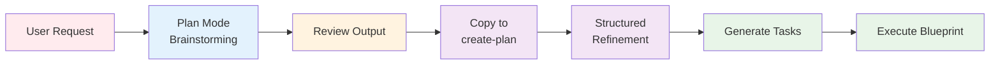
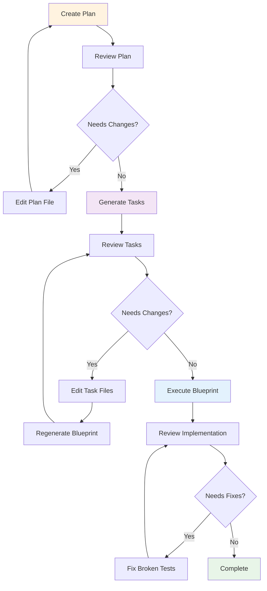
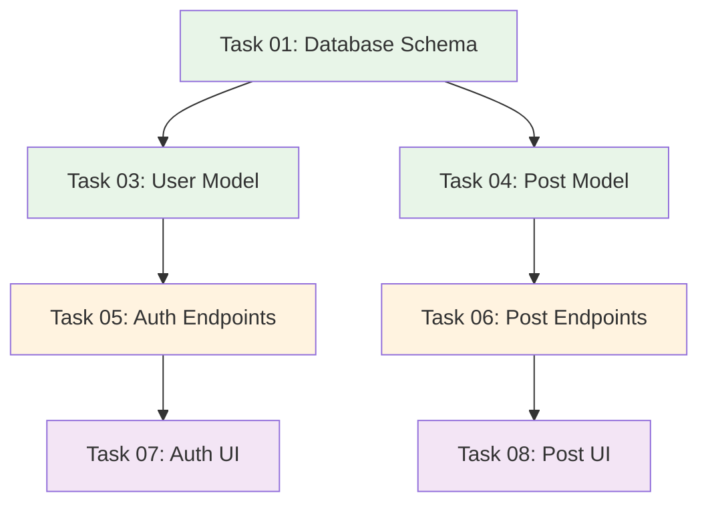

# 🔄 Workflow Patterns

AI Task Manager supports multiple workflow patterns to match your development style and project needs. This guide demonstrates advanced usage beyond the basic three-phase workflow.

## Pattern 1: Plan Mode Integration

**The most powerful workflow pattern**: Combine your AI assistant's native "plan mode" with AI Task Manager's structured execution.

### Why This Pattern?

AI assistant plan modes excel at:
- **Fast brainstorming**: Quick generation of initial ideas
- **Exploratory thinking**: Considering multiple approaches
- **Broad context**: Understanding user intent

AI Task Manager excels at:
- **Structured refinement**: Breaking ideas into executable tasks
- **Scope control**: Preventing feature creep through validation gates
- **Quality assurance**: Testing and validation at each phase
- **Progress tracking**: Clear visibility into implementation status

**Best of both worlds**: Use plan mode for ideation, AI Task Manager for execution.

### Step-by-Step Guide



**Step 1: Use Plan Mode for Initial Ideation**
```
You: Build a REST API for blog management

AI (in plan mode):
I'll create a comprehensive plan for a blog API with:
- User authentication (JWT tokens)
- CRUD operations for posts
- Comment system
- Tag/category management
- Search functionality
- Rate limiting
- ...
```

**Step 2: Review and Extract Relevant Parts**

Review the plan mode output and identify what you actually need:
- Keep: User auth, post CRUD, basic search
- Remove: Comment system (not requested), complex tag management, rate limiting (premature optimization)

**Step 3: Feed Refined Requirements to create-plan**
```bash
/tasks:create-plan Build a REST API for blog management with:
- User authentication using JWT tokens
- CRUD operations for blog posts (title, content, author, publish date)
- Basic search by title and content
- Use existing database schema from /db/schema.sql
```

**Step 4: AI Task Manager Structures the Work**

AI Task Manager now:
- Asks clarifying questions specific to your context
- Creates a focused plan without unnecessary features
- Documents technical decisions
- Identifies risks and success criteria

**Step 5: Continue with Standard Workflow**
```bash
# Review plan at .ai/task-manager/plans/01--blog-api/
# Edit if needed

/tasks:generate-tasks 1
# Review tasks, remove any scope creep
# Edit dependencies if needed

/tasks:execute-blueprint 1
# AI executes validated, scoped tasks
```

### Benefits of This Hybrid Approach

1. **Faster Start**: Plan mode generates initial ideas quickly
2. **Better Scope**: Human review catches unnecessary features before execution
3. **Context Preservation**: Plan mode explores broadly, Task Manager executes precisely
4. **Flexibility**: Skip plan mode for clear requirements, use it for exploratory projects

### When to Use Plan Mode Integration

**Use this pattern when:**
- Requirements are somewhat vague ("build a dashboard")
- Multiple implementation approaches exist
- You want AI to explore options before committing
- Project scope needs clarification

**Skip plan mode when:**
- Requirements are crystal clear
- Implementation path is obvious
- Small, focused tasks (bug fixes, minor features)

## Pattern 2: Iterative Refinement

**For projects requiring multiple rounds of feedback and adjustment.**

### Workflow Diagram



### Step-by-Step Process

**Phase 1: Plan Refinement**
```bash
# Create initial plan
/tasks:create-plan "Build user dashboard with analytics"

# Review generated plan
# Edit .ai/task-manager/plans/01--dashboard/plan-01--dashboard.md
# Refine objectives, add constraints, clarify scope

# If major changes needed, regenerate:
/tasks:create-plan "Build user dashboard with analytics. Focus on: daily active users, session duration, conversion funnel. Use Chart.js for visualization."
```

**Phase 2: Task Refinement**
```bash
# Generate tasks from refined plan
/tasks:generate-tasks 1

# Review tasks in .ai/task-manager/plans/01--dashboard/tasks/
# Common adjustments:
# - Remove tasks outside core scope
# - Split overly complex tasks
# - Adjust dependencies
# - Modify acceptance criteria

# If needed, manually edit task files and regenerate blueprint:
# (Edit individual task .md files)
# Tasks are automatically picked up by execute-blueprint
```

**Phase 3: Execution Monitoring and Adjustment**
```bash
# Execute with monitoring
/tasks:execute-blueprint 1

# Check status periodically
npx @e0ipso/ai-task-manager status

# If tests fail after implementation:
/tasks:fix-broken-tests "npm test"

# Review implementation quality
# Commit and continue
```

### Best Practices for Iterative Refinement

1. **Document Why**: When editing plans/tasks, add comments explaining changes
2. **Version Control**: Commit plan before generating tasks, commit tasks before execution
3. **Small Iterations**: Make incremental changes rather than massive rewrites
4. **Validation Points**: Use `status` command to verify state before major changes

## Pattern 3: Multi-Session Projects

**For complex projects spanning multiple days or weeks.**

### Session Management Strategy

**Session 1: Planning and Initial Setup**
```bash
# Day 1: Create comprehensive plan
/tasks:create-plan "Build e-commerce platform with product catalog, shopping cart, checkout, and payment processing"

# Review plan (this may take hours for complex projects)
# Refine and document decisions

# Generate tasks
/tasks:generate-tasks 1

# Review all tasks (identify phases you'll tackle first)
# Note: Don't feel pressured to execute everything immediately
```

**Session 2-N: Phased Execution**
```bash
# Day 2: Start with foundational tasks
npx @e0ipso/ai-task-manager status
# Shows: 15 tasks pending, 0 completed

/tasks:execute-blueprint 1
# AI executes Phase 1 (database schema, models)
# Commit results

# End of session: Check status
npx @e0ipso/ai-task-manager status
# Shows: 10 tasks pending, 5 completed (Phase 1)
```

**Resuming After Days/Weeks**
```bash
# New session: Resume where you left off
npx @e0ipso/ai-task-manager status

# Review completed tasks to refresh context
cat .ai/task-manager/plans/01--ecommerce/tasks/01--database-schema.md

# Continue execution (picks up where it left off)
/tasks:execute-blueprint 1
```

### Pausing and Resuming Best Practices

**Before Pausing:**
1. **Commit completed work**: `git commit` after each phase
2. **Document blockers**: If stuck, add notes to task files
3. **Update task status**: Ensure statuses are accurate (pending/in_progress/completed)

**When Resuming:**
1. **Review status dashboard**: `npx @e0ipso/ai-task-manager status`
2. **Check task dependencies**: Verify prerequisites are complete
3. **Refresh context**: Read recently completed task documents
4. **Continue execution**: `/tasks:execute-blueprint [plan-id]` picks up automatically

### Archiving Completed Plans

```bash
# When plan is fully complete:
mv .ai/task-manager/plans/01--ecommerce .ai/task-manager/archive/

# Archived plans remain accessible but don't clutter active workspace
# Status dashboard shows them in "Archived Plans" section
```

## Pattern 4: Parallel Development with Dependencies

**For teams or complex projects with independent workstreams.**

### Dependency Graph Strategy

AI Task Manager automatically generates dependency graphs during task generation:



### Parallel Execution Within Phases

**Phase 1: Independent Foundations**
- Task 01 (Database Schema) - no dependencies

**Phase 2: Parallel Model Development**
- Task 03 (User Model) - depends on 01
- Task 04 (Post Model) - depends on 01
- **These execute in parallel** (different models, no conflicts)

**Phase 3: Parallel API Development**
- Task 05 (Auth Endpoints) - depends on 03
- Task 06 (Post Endpoints) - depends on 04
- **These execute in parallel** (different API domains)

**Phase 4: Parallel UI Development**
- Task 07 (Auth UI) - depends on 05
- Task 08 (Post UI) - depends on 06
- **These execute in parallel** (different UI components)

### Team Coordination Pattern

**Scenario**: Backend developer and frontend developer working on same plan

**Setup:**
```bash
# Both developers initialize same project
git clone project-repo
cd project-repo
# .ai/task-manager/ already in repository (shared configuration)
```

**Backend Developer Workflow:**
```bash
# Focus on backend tasks
# Review blueprint: .ai/task-manager/plans/01--feature/plan-01--feature.md
# Identify backend tasks (skills: ["database", "api-endpoints"])

# Execute only backend phases
# AI Task Manager's skill-based assignment handles routing
```

**Frontend Developer Workflow:**
```bash
# Focus on frontend tasks
# Review same blueprint
# Identify frontend tasks (skills: ["react-components", "ui"])

# Execute frontend phases
# Dependencies ensure backend is ready first
```

**Coordination:**
- **Shared Plan**: Both developers work from same plan document
- **Task Status**: Git commits update task statuses for team visibility
- **Dependency Enforcement**: Frontend tasks blocked until backend dependencies complete
- **Pull Requests**: Each phase creates logical PR boundaries

### Best Practices for Parallel Development

1. **Clear Skill Boundaries**: Ensure tasks have distinct skill categories for clean parallelization
2. **Communication**: Use task comments for team updates
3. **Frequent Commits**: Commit after each phase to update team
4. **Dependency Validation**: Let PRE_PHASE hook validate dependencies are satisfied

## Pattern 5: Exploratory Spike → Production Implementation

**For uncertain technical approaches requiring proof-of-concept work.**

### Two-Plan Strategy

**Plan 1: Spike/Research Plan**
```bash
# Create exploratory plan
/tasks:create-plan "Research authentication approaches for multi-tenant SaaS: evaluate JWT vs session-based vs OAuth2 delegation. Create proof-of-concept for chosen approach."

/tasks:generate-tasks 1
# Tasks focused on research, prototyping, documentation
# Low quality gates (no tests, quick implementations)

/tasks:execute-blueprint 1
# Execute research tasks
# Result: Decision document and POC code
```

**Plan 2: Production Implementation Plan**
```bash
# Based on spike results, create production plan
/tasks:create-plan "Implement JWT-based authentication with refresh tokens for multi-tenant SaaS using findings from Plan 1. Follow production standards: tests, error handling, security hardening."

/tasks:generate-tasks 2
# Tasks focused on production quality
# High quality gates (tests, security, documentation)

/tasks:execute-blueprint 2
# Execute production tasks using spike learnings
```

### Benefits of Spike Pattern

- **Risk Reduction**: Validate technical approach before committing
- **Learning**: Explore unfamiliar technologies in isolated plan
- **Quality Separation**: Spike code can be messy; production code is polished
- **Documentation**: Spike plan documents decision rationale

## Choosing the Right Pattern

| Pattern | Best For | Time Investment | Complexity |
|---------|----------|----------------|------------|
| **Plan Mode Integration** | Vague requirements, exploratory projects | Medium | Low |
| **Iterative Refinement** | Evolving requirements, feedback-driven | High | Medium |
| **Multi-Session Projects** | Large projects, async work | Very High | Low |
| **Parallel Development** | Team collaboration, independent modules | High | Medium |
| **Spike → Production** | Technical uncertainty, new technologies | Medium | High |

## Combining Patterns

Patterns can be mixed:

**Example: Team Project with Plan Mode Integration**
1. Use **Plan Mode Integration** to explore initial ideas
2. Use **Iterative Refinement** to tune scope with stakeholders
3. Use **Multi-Session Projects** for gradual execution over weeks
4. Use **Parallel Development** for backend/frontend team coordination

**Example: Exploratory Feature Development**
1. Use **Spike → Production** for uncertain technical approach
2. Use **Plan Mode Integration** within spike for brainstorming
3. Use **Iterative Refinement** for production plan based on spike learnings

## Advanced Tips

### Workflow Pattern Documentation

Document your team's preferred patterns in `TASK_MANAGER.md`:

```markdown
## Team Workflow Patterns

### Standard Feature Development
1. Use plan mode for initial brainstorming
2. Create structured plan with /tasks:create-plan
3. Review plan with product owner
4. Generate and review tasks
5. Execute in phases with PR per phase

### Bug Fixes
1. Skip plan mode (requirements clear)
2. Create minimal plan (reproduce, fix, test)
3. Generate max 3 tasks
4. Execute immediately
5. Hot-fix deployment
```

### Custom Phase Actions

Add project-specific actions to PRE_PHASE and POST_PHASE hooks:

```markdown
## POST_PHASE Hook

After Phase 1 (Database/Models):
- Run database migrations in test environment
- Verify schema matches models

After Phase 2 (API Endpoints):
- Update OpenAPI documentation
- Run API integration tests
- Deploy to staging

After Phase 3 (UI Components):
- Run accessibility audit
- Deploy to preview environment
- Notify QA team
```

## Next Steps

- **Customize Hooks**: See [Customization Guide](customization.html) for project-specific validation gates
- **Understand Architecture**: See [How It Works](architecture.html) for design principles
- **Compare Approaches**: See [Comparison](comparison.html) for when to use AI Task Manager vs plan mode alone
